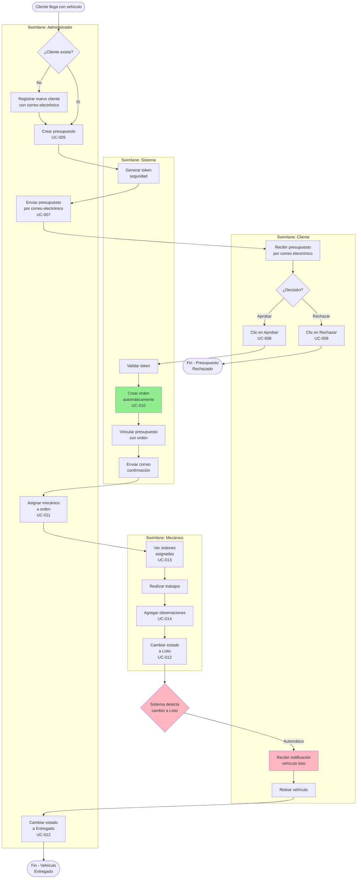
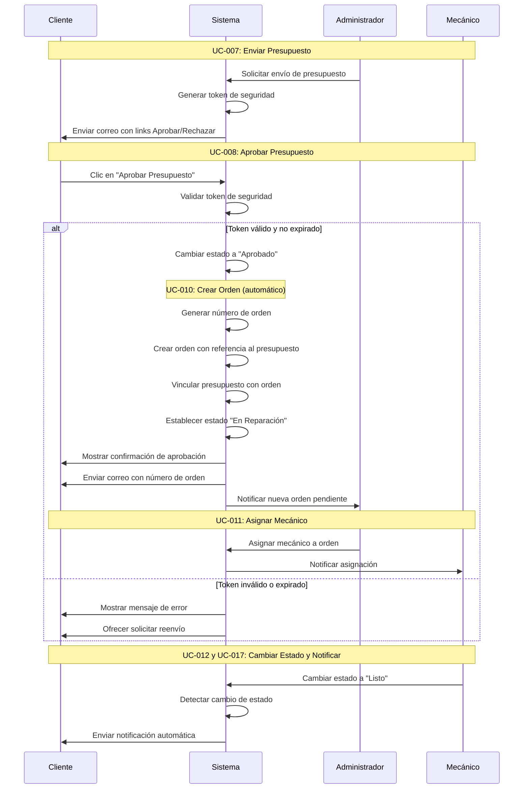
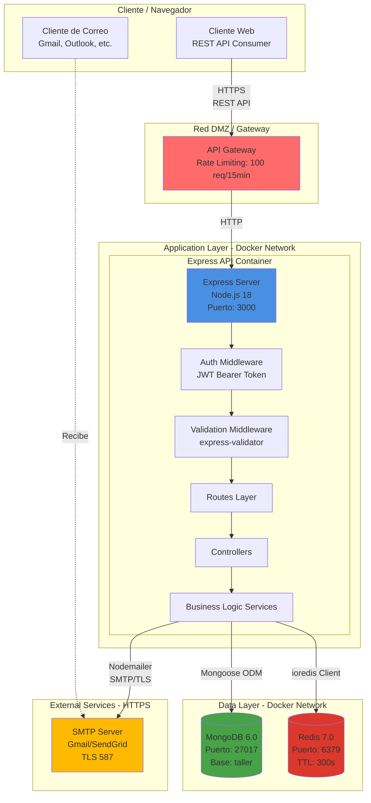
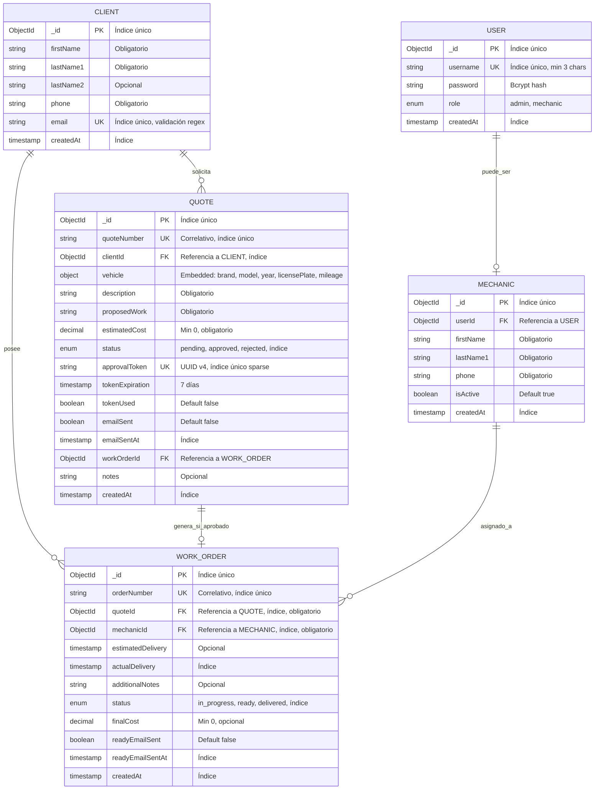
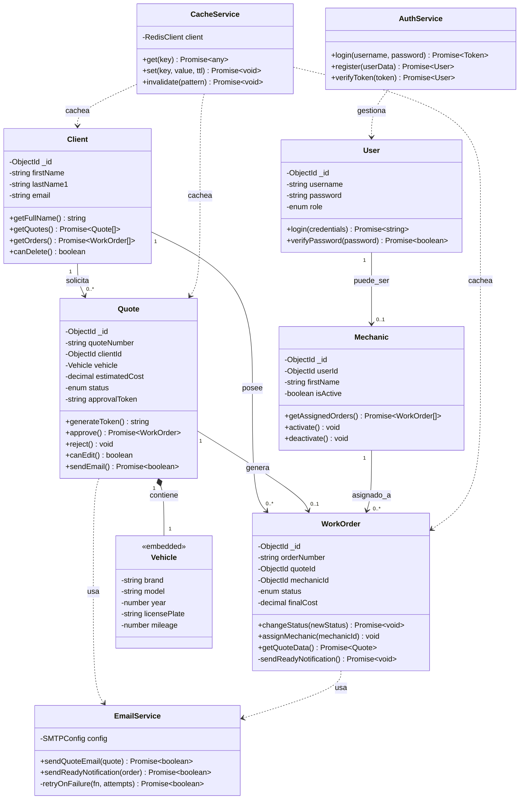
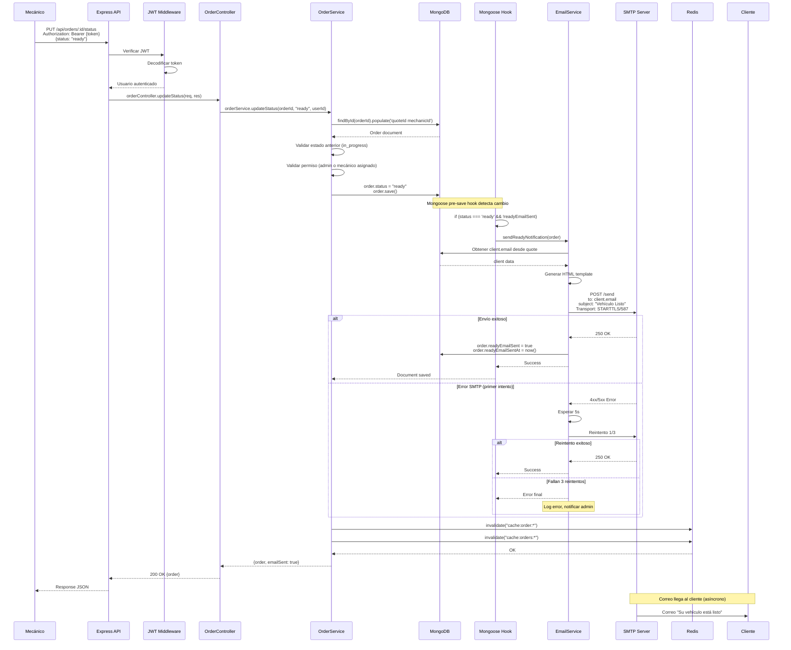
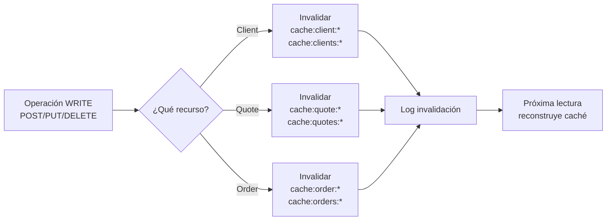
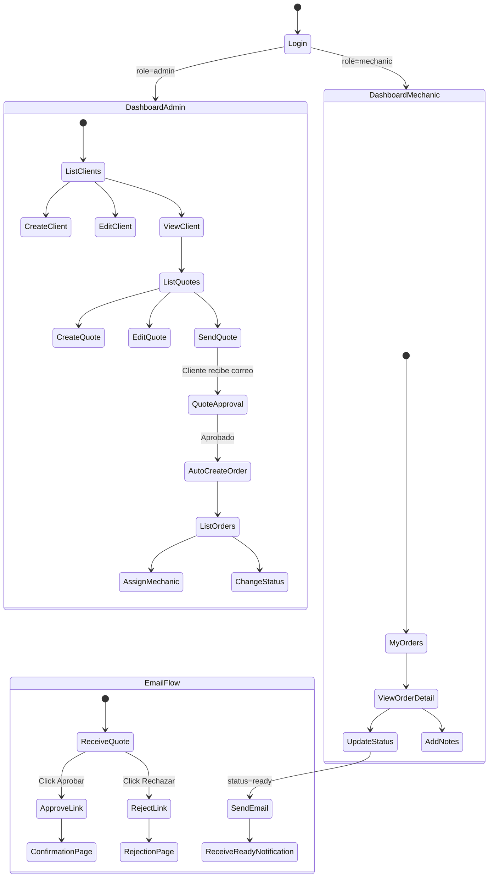

# DISEÑO FUNCIONAL Y TÉCNICO

**Versión:** 1.0  
**Fecha:** 31 Octubre 2025  
**Autor:** Equipo Desarrollo (Marcos Godoy, Alvaro Sandoval, Vicente Ortiz, Martin Valdebenito)  
**Revisor:** Pendiente  

---

## ÍNDICE
1. [Diseño Funcional](#1-diseño-funcional)
2. [Diseño Técnico](#2-diseño-técnico)
3. [Configuración y Despliegue](#3-configuración-y-despliegue)
4. [Checklist de Implementación](#4-checklist-de-implementación)

---

# 1. DISEÑO FUNCIONAL

## 1.1. Diagrama de Casos de Uso

**Trazabilidad:** REQ-002 (Gestión Clientes), REQ-003 (Gestión Presupuestos), REQ-004 (Gestión Órdenes), REQ-005 (Sistema Notificaciones)

**Límite del Sistema:** Sistema de Gestión de Taller Mecánico

```mermaid
graph TB
    subgraph "Sistema de Gestión de Taller Mecánico"
        direction TB
        
        %% Casos de Uso - Clientes
        UC1[UC-001: Registrar Cliente]
        UC2[UC-002: Editar Cliente]
        UC3[UC-003: Buscar Cliente]
        UC4[UC-004: Eliminar Cliente]
        
        %% Casos de Uso - Presupuestos
        UC5[UC-005: Crear Presupuesto]
        UC6[UC-006: Editar Presupuesto]
        UC7[UC-007: Enviar Presupuesto por Correo]
        UC8[UC-008: Aprobar Presupuesto]
        UC9[UC-009: Rechazar Presupuesto]
        
        %% Casos de Uso - Órdenes
        UC10[UC-010: Crear Orden de Trabajo]
        UC11[UC-011: Asignar Mecánico]
        UC12[UC-012: Actualizar Estado Orden]
        UC13[UC-013: Ver Órdenes Asignadas]
        UC14[UC-014: Agregar Observaciones]
        
        %% Casos de Uso - Sistema
        UC15[UC-015: Autenticar Usuario]
        UC16[UC-016: Gestionar Mecánicos]
        UC17[UC-017: Notificar Vehículo Listo]
        
        %% Relaciones include
        UC7 -.->|include| UC18[Validar Correo Electrónico]
        UC8 -.->|include| UC10
        UC12 -.->|include| UC17
        
        %% Relaciones extend
        UC5 -.->|extend| UC19[Duplicar Presupuesto Anterior]
    end
    
    %% Actores
    Admin[Administrador]
    Mech[Mecánico]
    Client[Cliente]
    EmailSys[Sistema de Correo Electrónico]
    
    %% Relaciones Administrador
    Admin --> UC1
    Admin --> UC2
    Admin --> UC3
    Admin --> UC4
    Admin --> UC5
    Admin --> UC6
    Admin --> UC7
    Admin --> UC8
    Admin --> UC9
    Admin --> UC11
    Admin --> UC12
    Admin --> UC15
    Admin --> UC16
    
    %% Relaciones Mecánico
    Mech --> UC13
    Mech --> UC12
    Mech --> UC14
    Mech --> UC15
    
    %% Relaciones Cliente
    Client --> UC8
    Client --> UC9
    
    %% Sistema Externo
    UC7 --> EmailSys
    UC17 --> EmailSys
    
    style UC10 fill:#90EE90
    style UC17 fill:#FFB6C1
```



**Leyenda:**
- **Verde claro:** Casos de uso automáticos (sin intervención manual)
- **Rosa claro:** Casos de uso con notificación automática
- **include:** Comportamiento común obligatorio
- **extend:** Variación opcional del caso de uso base

---

## 1.2. Diagrama de Flujo de Procesos (BPMN)

**Trazabilidad:** EPIC-QUOTE-001 (Flujo completo de presupuesto), REQ-007 (Reglas de negocio)

**Proceso:** Flujo Principal - Desde Presupuesto hasta Entrega



**Leyenda:**
- **Rombo:** Punto de decisión
- **Verde claro:** Proceso automático del sistema
- **Rosa claro:** Notificación automática
- **Círculo doble:** Fin del proceso

**Caminos Alternos:**
1. **Error en envío de correo:** Sistema reintenta 3 veces, si falla notifica al administrador
2. **Token expirado:** Cliente debe solicitar reenvío del presupuesto
3. **Cliente no retira vehículo:** Orden permanece en estado "Listo" hasta retiro

---

## 1.3. Diagrama de Secuencia Funcional

**Trazabilidad:** UC-008 (Aprobar Presupuesto), UC-010 (Crear Orden)

**Caso de Uso:** Aprobación de Presupuesto y Creación Automática de Orden



**Fragmentos utilizados:**
- `alt/else`: Validación de token con camino alternativo

---

## 1.4. Mapa de Funcionalidades por Rol

**Trazabilidad:** REQ-004 (Permisos por perfil)

### Administrador
| Módulo | Funcionalidades | Casos de Uso |
|--------|-----------------|--------------|
| Clientes | CRUD completo, búsqueda, historial | UC-001 a UC-004 |
| Presupuestos | CRUD, envío correo, aprobación manual, filtros | UC-005 a UC-009 |
| Órdenes | Visualización, asignación mecánicos, cambio estados | UC-011, UC-012 |
| Mecánicos | CRUD, activar/desactivar | UC-016 |
| Sistema | Acceso completo sin restricciones | UC-015 |

### Mecánico
| Módulo | Funcionalidades | Casos de Uso |
|--------|-----------------|--------------|
| Órdenes | Ver asignadas, actualizar estado, agregar notas | UC-013, UC-012, UC-014 |
| Sistema | Acceso limitado a sus órdenes | UC-015 |

### Cliente (sin autenticación)
| Módulo | Funcionalidades | Casos de Uso |
|--------|-----------------|--------------|
| Presupuestos | Aprobar/rechazar vía link con token | UC-008, UC-009 |
| Notificaciones | Recibir correos automáticos | UC-017 |

---

# 2. DISEÑO TÉCNICO

## 2.1. Diagrama de Arquitectura General (C4 - Nivel 2: Contenedores)

**Trazabilidad:** REQ-008 (Requisitos No Funcionales - Arquitectura)



**Leyenda:**
- **Línea sólida:** Comunicación sincrónica (HTTP/HTTPS)
- **Línea punteada:** Comunicación asíncrona (correo electrónico)
- **Colores:** Azul=API, Verde=MongoDB, Rojo=Redis, Amarillo=Externo, Rojo claro=Gateway

**Protocolos y Puertos:**
- API REST: HTTP/1.1 (interno), HTTPS/TLS 1.3 (externo)
- MongoDB: TCP/27017 (MongoDB Wire Protocol)
- Redis: TCP/6379 (RESP Protocol)
- SMTP: TLS/587 (STARTTLS)

**Límites de Confianza:**
- Red pública → Gateway (HTTPS obligatorio)
- Gateway → API (HTTP interno, red Docker aislada)
- API → MongoDB/Redis (TCP interno, red Docker aislada)
- API → SMTP (TLS obligatorio, red externa)

---

## 2.2. Diseño de Base de Datos (Diagrama ER)

**Trazabilidad:** REQ-006 (Datos a Almacenar), REQ-012 (Modelo de Datos)



**Cardinalidades y Opcionalidad:**
- `||--o|`: Uno a cero o uno (opcional)
- `||--o{`: Uno a cero o muchos

**Claves e Índices:**
- **PK:** Primary Key (automático en MongoDB como `_id`)
- **UK:** Unique Key (índice único)
- **FK:** Foreign Key (referencia a otra colección)
- **Índice:** Campo indexado para optimizar búsquedas

**Restricciones:**
- No se puede eliminar CLIENT si tiene QUOTE o WORK_ORDER asociados
- No se puede modificar QUOTE en estado "approved"
- No se puede eliminar WORK_ORDER en estado "ready" o "delivered"
- approvalToken debe ser único y no nulo cuando se genera

---

## 2.3. Diagrama de Clases (Modelo de Dominio)

**Trazabilidad:** REQ-013 (Consideraciones Técnicas - Estructura)



**Leyenda de Relaciones:**
- `-->`: Asociación (navegación unidireccional)
- `*--`: Composición (parte de, ciclo de vida dependiente)
- `..>`: Dependencia (usa temporalmente)

**Responsabilidades Principales:**
- **User/AuthService:** Autenticación y autorización
- **Quote:** Gestión de estado, generación de tokens, envío de correos
- **WorkOrder:** Cambio de estado con hooks, notificaciones automáticas
- **EmailService:** Envío de correos con reintentos
- **CacheService:** Gestión de caché y invalidación

---

## 2.4. Diagrama de Secuencia Técnico

**Trazabilidad:** UC-012 (Actualizar Estado Orden), UC-017 (Notificar Vehículo Listo)

**Escenario:** Cambio de Estado a "Listo" con Notificación Automática



**Detalles Técnicos:**
- **Protocolo:** HTTP/1.1 REST (API), SMTP/TLS (correo)
- **Timeout:** 30s para request API, 10s para SMTP
- **Reintentos:** 3 intentos con backoff exponencial (5s, 10s, 20s)
- **Idempotencia:** Flag `readyEmailSent` previene envíos duplicados
- **Códigos HTTP:**
  - 200: Éxito
  - 401: Token inválido
  - 403: Sin permisos
  - 404: Orden no encontrada
  - 422: Estado inválido

---

## 2.5. Estrategia de Caché con Redis

**Trazabilidad:** REQ-008 (Requisitos No Funcionales - Rendimiento)

### Estructura de Keys y TTL

| Pattern | Descripción | TTL | Invalidación |
|---------|-------------|-----|--------------|
| `cache:clients:list:{page}:{limit}` | Paginación de clientes | 300s (5min) | POST/PUT/DELETE /clients |
| `cache:client:{id}` | Cliente individual | 600s (10min) | PUT/DELETE /clients/:id |
| `cache:quotes:list:{status}:{page}` | Lista de presupuestos filtrados | 180s (3min) | POST/PUT /quotes |
| `cache:quote:{id}` | Presupuesto individual | 600s (10min) | PUT/DELETE /quotes/:id |
| `cache:orders:mechanic:{id}` | Órdenes de un mecánico | 120s (2min) | PUT /orders/:id |
| `cache:order:{id}` | Orden individual | 300s (5min) | PUT/DELETE /orders/:id |
| `cache:stats:dashboard` | Estadísticas generales | 600s (10min) | POST/PUT orders/quotes |

### Políticas de Invalidación



### Implementación de Cache Service

```javascript
// services/cacheService.js

class CacheService {
  constructor(redisClient) {
    this.redis = redisClient;
  }

  /**
   * Obtener dato cacheado o ejecutar función
   * @param {string} key - Clave de caché
   * @param {Function} fetchFn - Función para obtener datos si no hay caché
   * @param {number} ttl - Tiempo de vida en segundos
   */
  async getOrFetch(key, fetchFn, ttl = 300) {
    try {
      const cached = await this.redis.get(key);
      if (cached) {
        return JSON.parse(cached);
      }

      const data = await fetchFn();
      await this.redis.setex(key, ttl, JSON.stringify(data));
      return data;
    } catch (error) {
      console.error(`Cache error for key ${key}:`, error);
      return await fetchFn(); // Fallback sin caché
    }
  }

  /**
   * Invalidar patrón de claves
   * @param {string} pattern - Patrón de búsqueda (ej: "cache:order:*")
   */
  async invalidate(pattern) {
    try {
      const keys = await this.redis.keys(pattern);
      if (keys.length > 0) {
        await this.redis.del(...keys);
        console.log(`Invalidated ${keys.length} keys matching ${pattern}`);
      }
    } catch (error) {
      console.error(`Cache invalidation error:`, error);
    }
  }

  /**
   * Limpiar toda la caché (usar solo en desarrollo)
   */
  async flushAll() {
    await this.redis.flushall();
  }
}
```

### Ejemplo de Uso en Service

```javascript
// services/orderService.js

async getOrderById(orderId) {
  const cacheKey = `cache:order:${orderId}`;
  
  return await cacheService.getOrFetch(
    cacheKey,
    async () => {
      return await WorkOrder.findById(orderId)
        .populate('quoteId')
        .populate('mechanicId')
        .lean();
    },
    300 // 5 minutos
  );
}

async updateOrderStatus(orderId, newStatus, userId) {
  const order = await this.getOrderById(orderId);
  
  // Lógica de actualización...
  order.status = newStatus;
  await order.save();
  
  // Invalidar caché relacionado
  await cacheService.invalidate(`cache:order:${orderId}`);
  await cacheService.invalidate(`cache:orders:*`);
  
  return order;
}
```

### Métricas de Caché (para monitoreo)

- **Hit Rate esperado:** >70% en listados frecuentes
- **Reducción de carga en MongoDB:** ~50% en consultas populares
- **Tiempo de respuesta con caché:** <100ms
- **Tiempo de respuesta sin caché:** <2s

---

## 2.6. API REST - Endpoints Principales

**Trazabilidad:** REQ-013 (Endpoints), REQ-004 (Permisos)

### 2.6.1. Autenticación

| Método | Endpoint | Descripción | Auth | Entrada | Salida | Caso de Uso |
|--------|----------|-------------|------|---------|--------|-------------|
| POST | `/api/auth/login` | Iniciar sesión | No | `{username: string, password: string}` | `{token: string, user: {id, username, role}}` | UC-015 |
| POST | `/api/auth/register` | Registrar usuario | Admin | `{username: string, password: string, role: enum}` | `{user: {id, username, role}}` | UC-015 |
| GET | `/api/auth/me` | Usuario actual | Sí | - | `{user: {id, username, role}}` | UC-015 |
| POST | `/api/auth/logout` | Cerrar sesión | Sí | - | `{message: string}` | UC-015 |

**Códigos de Respuesta:**
- 200: Éxito
- 201: Creado
- 401: No autenticado
- 403: Sin permisos
- 422: Datos inválidos

---

### 2.6.2. Clientes

| Método | Endpoint | Descripción | Auth | Entrada | Salida | Caso de Uso |
|--------|----------|-------------|------|---------|--------|-------------|
| GET | `/api/clients` | Listar clientes | Admin | Query: `?page=1&limit=20&search=texto` | `{clients: [], pagination: {total, page, pages}}` | UC-003 |
| GET | `/api/clients/:id` | Ver cliente | Admin | - | `{client: {id, firstName, lastName1, email, ...}}` | UC-003 |
| POST | `/api/clients` | Crear cliente | Admin | `{firstName, lastName1, lastName2?, phone, email}` | `{client: {...}}` | UC-001 |
| PUT | `/api/clients/:id` | Editar cliente | Admin | `{firstName?, lastName1?, phone?, email?}` | `{client: {...}}` | UC-002 |
| DELETE | `/api/clients/:id` | Eliminar cliente | Admin | - | `{message: string}` | UC-004 |
| GET | `/api/clients/:id/quotes` | Presupuestos del cliente | Admin | Query: `?status=pending` | `{quotes: []}` | UC-003 |
| GET | `/api/clients/:id/orders` | Órdenes del cliente | Admin | Query: `?status=in_progress` | `{orders: []}` | UC-003 |

**Validaciones:**
- `email`: Formato válido, único en sistema
- `phone`: Mínimo 9 caracteres
- No eliminar si tiene presupuestos u órdenes asociadas

---

### 2.6.3. Presupuestos

| Método | Endpoint | Descripción | Auth | Entrada | Salida | Caso de Uso |
|--------|----------|-------------|------|---------|--------|-------------|
| GET | `/api/quotes` | Listar presupuestos | Admin | Query: `?status=pending&clientId=xxx&page=1` | `{quotes: [], pagination: {...}}` | UC-006 |
| GET | `/api/quotes/:id` | Ver presupuesto | Admin | - | `{quote: {...}, client: {...}}` | UC-006 |
| POST | `/api/quotes` | Crear presupuesto | Admin | `{clientId, vehicle: {brand, model, year, licensePlate, mileage}, description, proposedWork, estimatedCost, notes?}` | `{quote: {...}}` | UC-005 |
| PUT | `/api/quotes/:id` | Editar presupuesto | Admin | `{description?, proposedWork?, estimatedCost?, notes?}` | `{quote: {...}}` | UC-006 |
| DELETE | `/api/quotes/:id` | Eliminar presupuesto | Admin | - | `{message: string}` | - |
| POST | `/api/quotes/:id/send-email` | Enviar por correo | Admin | - | `{message: string, emailSent: boolean, token: string}` | UC-007 |
| GET | `/api/quotes/:id/approve` | Aprobar (cliente con token) | No | Query: `?token=uuid` | HTML: Página de confirmación | UC-008 |
| PUT | `/api/quotes/:id/approve` | Aprobar (admin manual) | Admin | - | `{quote: {...}, workOrder: {...}}` | UC-008 |
| GET | `/api/quotes/:id/reject` | Rechazar (cliente con token) | No | Query: `?token=uuid` | HTML: Página de confirmación | UC-009 |
| PUT | `/api/quotes/:id/reject` | Rechazar (admin manual) | Admin | - | `{quote: {...}}` | UC-009 |

**Validaciones:**
- Solo editable si status = `pending`
- `estimatedCost` > 0
- `vehicle.year` entre 1900 y año actual + 1
- Token válido y no expirado para aprobación/rechazo
- No eliminar si tiene orden asociada

---

### 2.6.4. Órdenes de Trabajo

| Método | Endpoint | Descripción | Auth | Entrada | Salida | Caso de Uso |
|--------|----------|-------------|------|---------|--------|-------------|
| GET | `/api/orders` | Listar órdenes | Admin/Mechanic | Query: `?status=in_progress&mechanicId=xxx&page=1` | `{orders: [], pagination: {...}}` | UC-013 |
| GET | `/api/orders/:id` | Ver orden | Admin/Mechanic | - | `{order: {...}, quote: {...}, client: {...}}` | UC-013 |
| PUT | `/api/orders/:id` | Editar orden | Admin | `{additionalNotes?, finalCost?, estimatedDelivery?}` | `{order: {...}}` | UC-014 |
| PUT | `/api/orders/:id/status` | Cambiar estado | Admin/Mechanic | `{status: enum}` | `{order: {...}, emailSent?: boolean}` | UC-012 |
| PUT | `/api/orders/:id/assign` | Asignar mecánico | Admin | `{mechanicId: ObjectId}` | `{order: {...}}` | UC-011 |
| DELETE | `/api/orders/:id` | Eliminar orden | Admin | - | `{message: string}` | - |

**Validaciones:**
- Mecánico solo ve/modifica sus órdenes asignadas
- Solo eliminar si status = `in_progress`
- Estados permitidos: `in_progress` → `ready` → `delivered`
- Al cambiar a `ready`: trigger automático de correo electrónico (UC-017)

---

### 2.6.5. Mecánicos

| Método | Endpoint | Descripción | Auth | Entrada | Salida | Caso de Uso |
|--------|----------|-------------|------|---------|--------|-------------|
| GET | `/api/mechanics` | Listar mecánicos | Admin | Query: `?isActive=true` | `{mechanics: []}` | UC-016 |
| GET | `/api/mechanics/:id` | Ver mecánico | Admin | - | `{mechanic: {...}}` | UC-016 |
| POST | `/api/mechanics` | Crear mecánico | Admin | `{userId, firstName, lastName1, phone}` | `{mechanic: {...}}` | UC-016 |
| PUT | `/api/mechanics/:id` | Editar mecánico | Admin | `{firstName?, lastName1?, phone?, isActive?}` | `{mechanic: {...}}` | UC-016 |
| GET | `/api/mechanics/:id/orders` | Órdenes del mecánico | Admin/Mechanic | Query: `?status=in_progress` | `{orders: []}` | UC-013 |

**Validaciones:**
- `userId` debe existir y no estar asociado a otro mecánico
- No eliminar mecánicos con órdenes activas

---

## 2.7. Diagrama de Navegación UI (Wireframes)

**Trazabilidad:** REQ-001 (Descripción del problema - necesidad de interfaz)

**Nota:** Este MVP se enfoca en API REST. Las interfaces serán implementadas en versiones futuras.



**Estados de Interfaz Críticos:**
- **Carga:** Spinner mientras se obtienen datos de API
- **Vacío:** Mensaje "No hay registros" con botón de acción
- **Error:** Mensaje de error con opción de reintentar
- **Éxito:** Notificación toast temporal

---

# 3. CONFIGURACIÓN Y DESPLIEGUE

## 3.1. Docker Compose

**Archivo:** `docker-compose.yml`

```yaml
version: '3.8'

services:
  # API Node.js
  api:
    build:
      context: .
      dockerfile: Dockerfile
    container_name: taller_api
    ports:
      - "3000:3000"
    environment:
      - NODE_ENV=production
      - PORT=3000
      - MONGODB_URI=mongodb://mongo:27017/taller
      - REDIS_URL=redis://redis:6379
      - JWT_SECRET=${JWT_SECRET}
      - JWT_EXPIRES_IN=24h
      - SMTP_HOST=${SMTP_HOST}
      - SMTP_PORT=${SMTP_PORT}
      - SMTP_USER=${SMTP_USER}
      - SMTP_PASS=${SMTP_PASS}
      - SMTP_FROM=Taller Mecánico <noreply@taller.com>
      - API_URL=http://localhost:3000
    depends_on:
      mongo:
        condition: service_healthy
      redis:
        condition: service_started
    volumes:
      - ./logs:/app/logs
    networks:
      - taller_network
    restart: unless-stopped
    healthcheck:
      test: ["CMD", "curl", "-f", "http://localhost:3000/api/health"]
      interval: 30s
      timeout: 10s
      retries: 3

  # MongoDB
  mongo:
    image: mongo:6.0
    container_name: taller_mongo
    ports:
      - "27017:27017"
    environment:
      - MONGO_INITDB_DATABASE=taller
    volumes:
      - mongo_data:/data/db
      - ./mongo-init:/docker-entrypoint-initdb.d
    networks:
      - taller_network
    restart: unless-stopped
    healthcheck:
      test: ["CMD", "mongosh", "--eval", "db.adminCommand('ping')"]
      interval: 10s
      timeout: 5s
      retries: 5

  # Redis
  redis:
    image: redis:7.0-alpine
    container_name: taller_redis
    ports:
      - "6379:6379"
    command: redis-server --appendonly yes --requirepass ${REDIS_PASSWORD}
    volumes:
      - redis_data:/data
    networks:
      - taller_network
    restart: unless-stopped
    healthcheck:
      test: ["CMD", "redis-cli", "ping"]
      interval: 10s
      timeout: 5s
      retries: 5

volumes:
  mongo_data:
    driver: local
  redis_data:
    driver: local

networks:
  taller_network:
    driver: bridge
```

---

## 3.2. Dockerfile

**Archivo:** `Dockerfile`

```dockerfile
# Etapa 1: Builder
FROM node:18-alpine AS builder

WORKDIR /app

# Copiar archivos de dependencias
COPY package*.json ./

# Instalar dependencias
RUN npm ci --only=production

# Etapa 2: Runner
FROM node:18-alpine

# Instalar curl para healthcheck
RUN apk add --no-cache curl

WORKDIR /app

# Copiar node_modules desde builder
COPY --from=builder /app/node_modules ./node_modules

# Copiar código fuente
COPY . .

# Crear usuario no-root
RUN addgroup -g 1001 -S nodejs && \
    adduser -S nodejs -u 1001 && \
    chown -R nodejs:nodejs /app

USER nodejs

EXPOSE 3000

# Comando de inicio
CMD ["node", "src/server.js"]
```

---

## 3.3. Variables de Entorno

**Archivo:** `.env.example`

```bash
# ============================================
# SERVER CONFIGURATION
# ============================================
NODE_ENV=development
PORT=3000
API_URL=http://localhost:3000

# ============================================
# DATABASE - MONGODB
# ============================================
MONGODB_URI=mongodb://localhost:27017/taller
MONGO_DB_NAME=taller

# ============================================
# CACHE - REDIS
# ============================================
REDIS_URL=redis://localhost:6379
REDIS_PASSWORD=change-me-in-production
CACHE_TTL=300

# ============================================
# AUTHENTICATION - JWT
# ============================================
JWT_SECRET=your-super-secret-key-change-in-production-min-32-chars
JWT_EXPIRES_IN=24h

# ============================================
# EMAIL - SMTP
# ============================================
SMTP_HOST=smtp.gmail.com
SMTP_PORT=587
SMTP_SECURE=false
SMTP_USER=your-email@gmail.com
SMTP_PASS=your-app-specific-password
SMTP_FROM=Taller Mecánico <noreply@taller.com>

# ============================================
# TOKENS
# ============================================
APPROVAL_TOKEN_EXPIRATION=7d

# ============================================
# RATE LIMITING
# ============================================
RATE_LIMIT_WINDOW_MS=900000
RATE_LIMIT_MAX_REQUESTS=100

# ============================================
# LOGGING
# ============================================
LOG_LEVEL=info
LOG_FILE=./logs/app.log
```

---

## 3.4. Estructura del Proyecto

```
taller-api/
├── src/
│   ├── config/
│   │   ├── database.js          # Configuración MongoDB
│   │   ├── redis.js             # Configuración Redis
│   │   ├── email.js             # Configuración Nodemailer
│   │   └── env.js               # Validación variables entorno
│   ├── models/
│   │   ├── User.js              # Esquema usuarios
│   │   ├── Client.js            # Esquema clientes
│   │   ├── Quote.js             # Esquema presupuestos
│   │   ├── WorkOrder.js         # Esquema órdenes
│   │   └── Mechanic.js          # Esquema mecánicos
│   ├── routes/
│   │   ├── index.js             # Router principal
│   │   ├── auth.routes.js       # Rutas autenticación
│   │   ├── clients.routes.js    # Rutas clientes
│   │   ├── quotes.routes.js     # Rutas presupuestos
│   │   ├── orders.routes.js     # Rutas órdenes
│   │   └── mechanics.routes.js  # Rutas mecánicos
│   ├── controllers/
│   │   ├── authController.js
│   │   ├── clientController.js
│   │   ├── quoteController.js
│   │   ├── orderController.js
│   │   └── mechanicController.js
│   ├── services/
│   │   ├── authService.js       # Lógica autenticación
│   │   ├── clientService.js     # Lógica clientes
│   │   ├── quoteService.js      # Lógica presupuestos
│   │   ├── orderService.js      # Lógica órdenes
│   │   ├── emailService.js      # Envío correos
│   │   └── cacheService.js      # Gestión caché Redis
│   ├── middlewares/
│   │   ├── auth.middleware.js         # Verificación JWT
│   │   ├── validation.middleware.js   # Validación datos
│   │   ├── errorHandler.middleware.js # Manejo errores global
│   │   └── rateLimiter.middleware.js  # Límite peticiones
│   ├── utils/
│   │   ├── tokenGenerator.js    # Generación tokens aprobación
│   │   ├── emailTemplates.js    # Templates HTML correos
│   │   ├── validators.js        # Validadores custom
│   │   └── logger.js            # Winston logger
│   ├── app.js                   # Configuración Express
│   └── server.js                # Punto de entrada
├── tests/
│   ├── unit/
│   │   ├── services/
│   │   └── utils/
│   └── integration/
│       ├── auth.test.js
│       ├── quotes.test.js
│       └── orders.test.js
├── docs/
│   ├── postman/
│   │   └── taller-api.postman_collection.json
│   ├── arquitectura.png
│   └── er-diagram.png
├── mongo-init/
│   └── init-db.js               # Script inicialización BD
├── logs/
│   └── .gitkeep
├── .env.example
├── .env                          # Git ignored
├── .dockerignore
├── .gitignore
├── Dockerfile
├── docker-compose.yml
├── package.json
├── package-lock.json
├── README.md
├── REQUERIMIENTOS.md
└── DISENO.md
```

---

# 4. CHECKLIST DE IMPLEMENTACIÓN

## 4.1. Fase 1 - Infraestructura (Semana 1)

### Setup Inicial
- [ ] Crear repositorio Git con Gitflow (main/develop)
- [ ] Estructura de carpetas completa
- [ ] Configurar ESLint y Prettier
- [ ] Crear .env.example con todas las variables

### Docker
- [ ] docker-compose.yml configurado
- [ ] Dockerfile optimizado (multi-stage)
- [ ] Healthchecks para todos los servicios
- [ ] Script init-db.js para MongoDB

### Base de Datos
- [ ] Conexión MongoDB exitosa
- [ ] Índices creados en colecciones
- [ ] Script de seed para datos de prueba

### Cache
- [ ] Conexión Redis exitosa
- [ ] CacheService implementado
- [ ] Pruebas de get/set/invalidate

### Logger
- [ ] Winston configurado
- [ ] Logs en archivo y consola
- [ ] Niveles: error, warn, info, debug

---

## 4.2. Fase 2 - Autenticación y Usuarios (Semana 1)

### Modelos
- [ ] User model con validaciones
- [ ] Hook pre-save para bcrypt
- [ ] Método verifyPassword
- [ ] Índices en username

### Endpoints
- [ ] POST /api/auth/register (Admin only)
- [ ] POST /api/auth/login
- [ ] GET /api/auth/me
- [ ] POST /api/auth/logout

### Middlewares
- [ ] auth.middleware.js para JWT
- [ ] Verificación de roles (admin/mechanic)
- [ ] Manejo de token expirado

### Testing
- [ ] Test login exitoso
- [ ] Test login con credenciales inválidas
- [ ] Test acceso sin token
- [ ] Test token expirado

---

## 4.3. Fase 3 - Gestión de Clientes (Semana 1)

### Modelo
- [ ] Client model completo
- [ ] Validación correo electrónico (regex)
- [ ] Índices en email y nombre
- [ ] Método canDelete()

### Endpoints
- [ ] GET /api/clients (con paginación y búsqueda)
- [ ] GET /api/clients/:id
- [ ] POST /api/clients
- [ ] PUT /api/clients/:id
- [ ] DELETE /api/clients/:id (validar sin dependencias)
- [ ] GET /api/clients/:id/quotes
- [ ] GET /api/clients/:id/orders

### Cache
- [ ] Cache en listado de clientes
- [ ] Cache en cliente individual
- [ ] Invalidación al crear/editar/eliminar

### Testing
- [ ] Test CRUD completo
- [ ] Test validación correo único
- [ ] Test eliminar con presupuestos asociados (debe fallar)
- [ ] Test búsqueda por nombre

---

## 4.4. Fase 4 - Presupuestos (Semana 2)

### Modelo
- [ ] Quote model con vehicle embedded
- [ ] Generación automática quoteNumber
- [ ] Validaciones de datos vehículo
- [ ] Método generateToken()
- [ ] Método canEdit()

### Endpoints
- [ ] GET /api/quotes (filtros: status, clientId, fecha)
- [ ] GET /api/quotes/:id
- [ ] POST /api/quotes
- [ ] PUT /api/quotes/:id (solo si pending)
- [ ] DELETE /api/quotes/:id
- [ ] POST /api/quotes/:id/send-email
- [ ] GET /api/quotes/:id/approve?token=xxx
- [ ] PUT /api/quotes/:id/approve (admin manual)
- [ ] GET /api/quotes/:id/reject?token=xxx
- [ ] PUT /api/quotes/:id/reject (admin manual)

### Validaciones
- [ ] Solo editar si status = pending
- [ ] estimatedCost > 0
- [ ] vehicle.year válido
- [ ] Token válido y no expirado
- [ ] Token no usado previamente

### Testing
- [ ] Test crear presupuesto válido
- [ ] Test editar presupuesto aprobado (debe fallar)
- [ ] Test aprobación con token válido
- [ ] Test aprobación con token expirado
- [ ] Test aprobación duplicada

---

## 4.5. Fase 5 - Correos Electrónicos (Semana 2)

### Email Service
- [ ] Nodemailer configurado con SMTP
- [ ] Template HTML presupuesto
- [ ] Template HTML vehículo listo
- [ ] Sistema de reintentos (3 intentos)
- [ ] Logs de envío (éxito/fallo)

### Métodos
- [ ] sendQuoteEmail(quote)
- [ ] sendReadyNotification(order)
- [ ] sendApprovalConfirmation(quote, order)
- [ ] Método privado retry() con backoff

### Validaciones
- [ ] Verificar cliente tiene correo válido
- [ ] Timeout de 10s por intento
- [ ] Marcar emailSent = true al enviar

### Testing
- [ ] Test envío presupuesto exitoso
- [ ] Test envío con correo inválido
- [ ] Test sistema de reintentos
- [ ] Test generación templates HTML

---

## 4.6. Fase 6 - Órdenes de Trabajo (Semana 3)

### Modelo
- [ ] WorkOrder model completo
- [ ] Generación automática orderNumber
- [ ] Referencia a quoteId (obligatoria)
- [ ] Hook pre-save para correo automático
- [ ] Método changeStatus()

### Creación Automática
- [ ] Al aprobar presupuesto, crear orden
- [ ] Estado inicial: in_progress
- [ ] Vincular orden con presupuesto (bidireccional)
- [ ] Usar transacción MongoDB
- [ ] Rollback si falla algún paso

### Endpoints
- [ ] GET /api/orders (filtros: status, mechanicId)
- [ ] GET /api/orders/:id (populate quote y client)
- [ ] PUT /api/orders/:id (editar notas, costo)
- [ ] PUT /api/orders/:id/status
- [ ] PUT /api/orders/:id/assign (asignar mecánico)
- [ ] DELETE /api/orders/:id (solo si in_progress)

### Hook Automático
- [ ] Detectar cambio de status a ready
- [ ] Verificar !readyEmailSent
- [ ] Enviar correo automático
- [ ] Marcar readyEmailSent = true

### Validaciones
- [ ] Estados válidos: in_progress → ready → delivered
- [ ] Mecánico solo ve sus órdenes
- [ ] No eliminar si ready o delivered

### Testing
- [ ] Test creación automática al aprobar
- [ ] Test vinculación presupuesto-orden
- [ ] Test cambio estado a ready (debe enviar correo)
- [ ] Test correo no se envía dos veces
- [ ] Test mecánico solo ve sus órdenes

---

## 4.7. Fase 7 - Mecánicos (Semana 3)

### Modelo
- [ ] Mechanic model completo
- [ ] Referencia a userId
- [ ] Campo isActive

### Endpoints
- [ ] GET /api/mechanics
- [ ] GET /api/mechanics/:id
- [ ] POST /api/mechanics
- [ ] PUT /api/mechanics/:id
- [ ] GET /api/mechanics/:id/orders

### Validaciones
- [ ] userId único (un user = un mechanic)
- [ ] No eliminar con órdenes activas

### Testing
- [ ] Test CRUD completo
- [ ] Test obtener órdenes asignadas
- [ ] Test activar/desactivar

---

## 4.8. Fase 8 - Refinamiento (Semana 4)

### Validaciones Completas
- [ ] Todas las reglas de negocio implementadas
- [ ] Manejo de errores consistente
- [ ] Mensajes de error descriptivos
- [ ] Códigos HTTP apropiados

### Seguridad
- [ ] Sanitización de inputs (express-validator)
- [ ] Protección contra NoSQL injection
- [ ] Rate limiting en endpoints públicos
- [ ] Headers de seguridad (helmet)

### Testing Integración
- [ ] Flujo completo: crear cliente → presupuesto → aprobar → orden → listo → entregado
- [ ] Test envío correos en flujo completo
- [ ] Test caché en endpoints críticos
- [ ] Test permisos por rol

### Documentación
- [ ] README.md con instrucciones setup
- [ ] Colección Postman completa
- [ ] Comentarios en código crítico
- [ ] Diagramas exportados a /docs

### Performance
- [ ] Consultas MongoDB optimizadas
- [ ] Índices verificados
- [ ] Cache implementado en listados
- [ ] Tiempo de respuesta < 2s

### Deploy
- [ ] docker-compose up exitoso
- [ ] Healthchecks funcionando
- [ ] Logs persistentes
- [ ] Variables de entorno documentadas

---

## 4.9. Entrega Final

### Código
- [ ] Al menos 10 commits descriptivos en develop
- [ ] Código limpio y comentado
- [ ] Sin console.log en producción
- [ ] Sin credenciales en código

### Documentación
- [ ] REQUERIMIENTOS.md completo
- [ ] DISENO.md completo con diagramas
- [ ] README.md con setup e instrucciones
- [ ] Colección Postman funcional

### Funcionalidad
- [ ] Todos los endpoints funcionando
- [ ] Flujo presupuesto → orden completo
- [ ] Correos enviándose correctamente
- [ ] Caché funcionando

### Base de Datos
- [ ] Datos de prueba (seed)
- [ ] Índices creados
- [ ] Relaciones correctas

---

# NOTAS DE CAMBIOS

## Versión 1.0 - 31 Octubre 2025
- Creación inicial del documento de diseño
- Diagramas funcionales: casos de uso, flujos BPMN, secuencia
- Diagramas técnicos: arquitectura C4, ER, clases, secuencia técnica
- Definición completa de API REST con endpoints
- Estrategia de caché Redis documentada
- Configuración Docker y estructura de proyecto
- Checklist de implementación por fases

---

**FIN DEL DOCUMENTO**

**Próximos Revisores:** [Pendiente asignación]  
**Estado:** Aprobado para desarrollo  
**Próxima Revisión:** Al finalizar Semana 2
