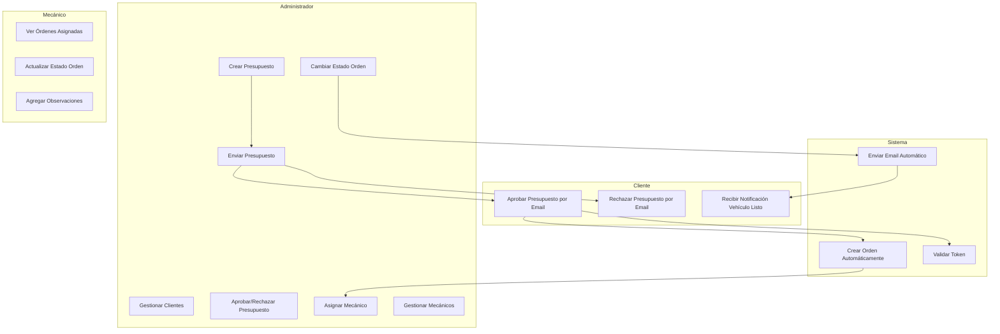
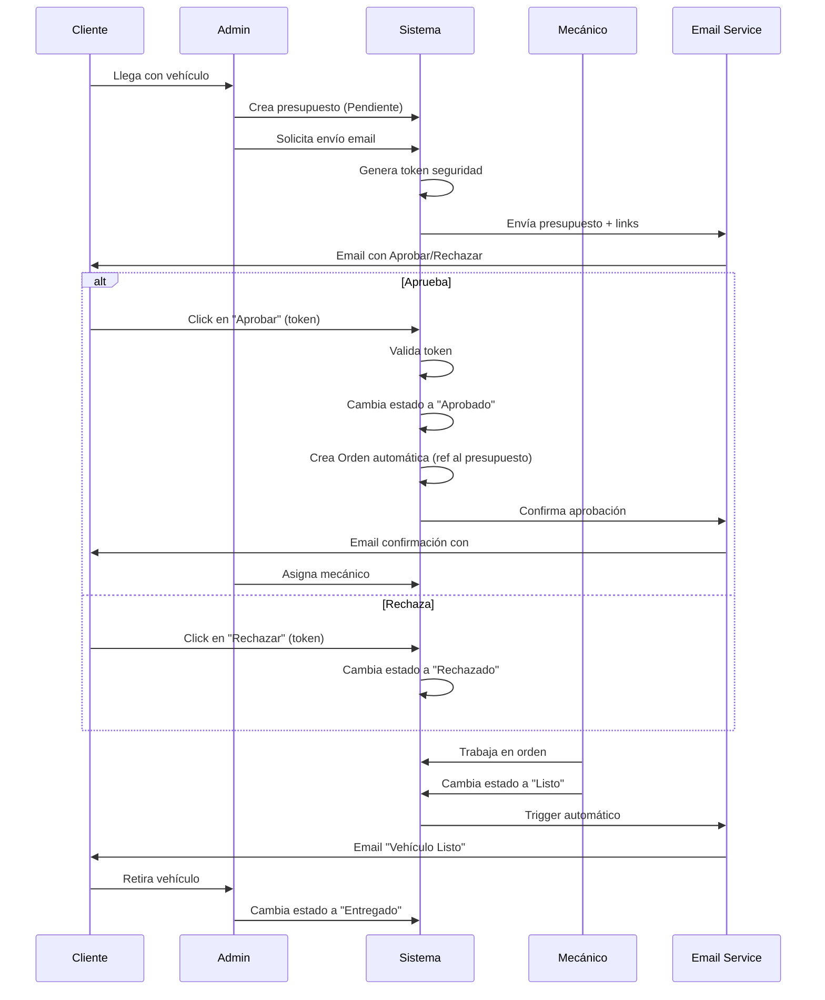
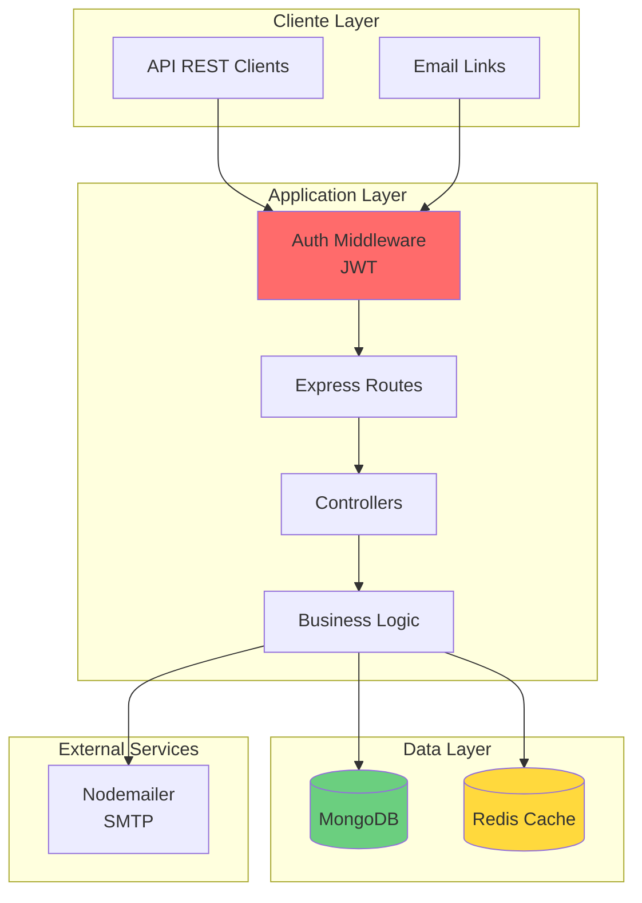
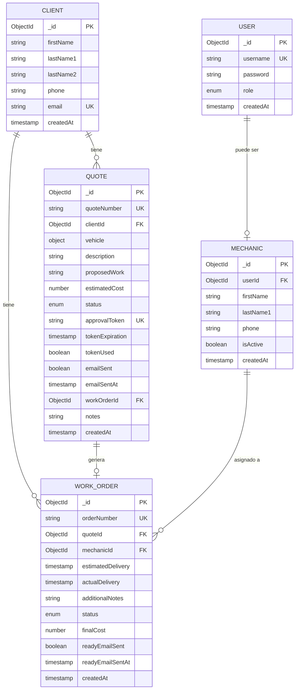
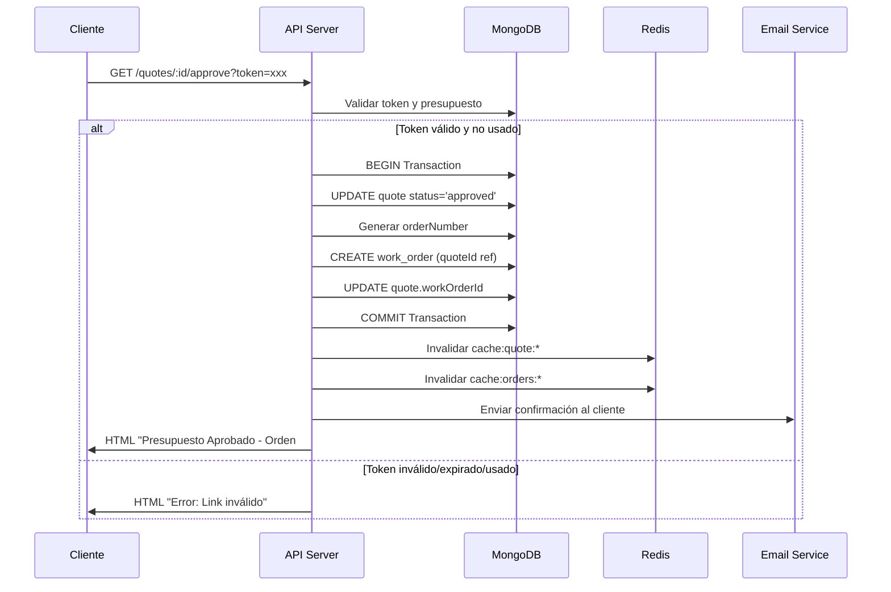
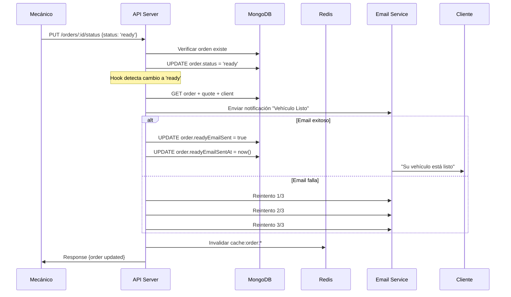
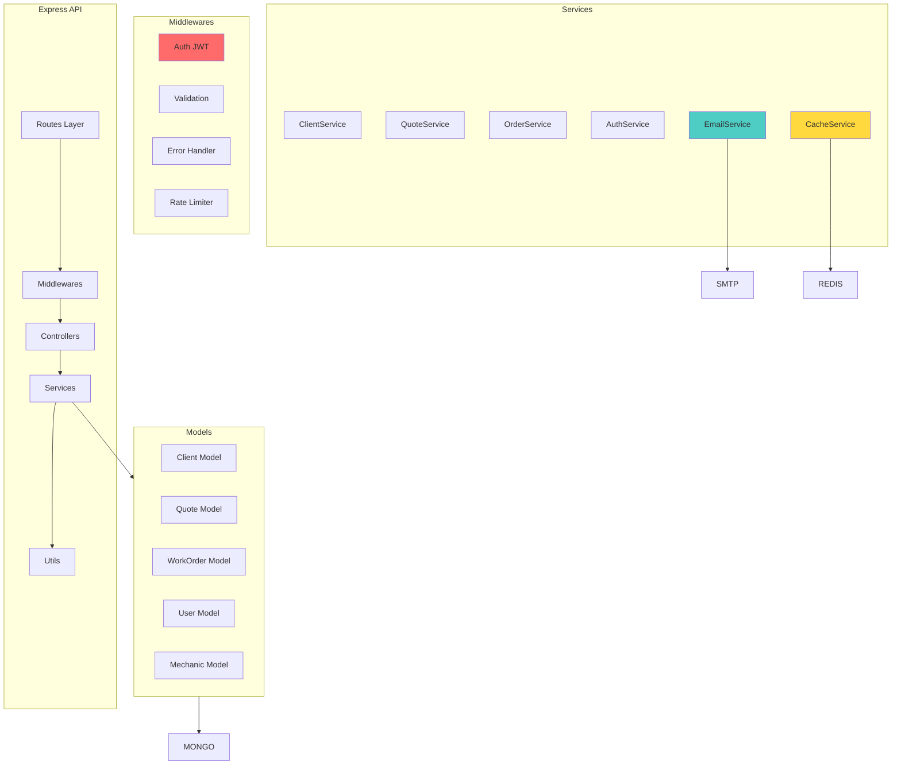

# DISEÑO FUNCIONAL Y TÉCNICO

## 1. Diagrama de Casos de Uso



## 2. Mapa de Funcionalidades por Rol

### Administrador
- **Clientes:** CRUD completo, búsqueda, historial
- **Presupuestos:** CRUD, envío email, aprobación manual, filtros
- **Órdenes:** Visualización, asignación mecánicos, cambio estados
- **Mecánicos:** CRUD, activar/desactivar
- **Acceso:** Sin restricciones

### Mecánico
- **Órdenes:** Ver asignadas, actualizar estado, agregar notas
- **Acceso:** Solo sus órdenes

### Cliente (sin login)
- **Presupuestos:** Aprobar/rechazar vía link con token
- **Notificaciones:** Recibe emails automáticos

## 3. Flujo Principal del Negocio



## 4. Arquitectura General del Sistema



### Stack Detallado
- **Backend:** Node.js v18+ con Express v4.18+
- **Base de Datos:** MongoDB v6.0+ con Mongoose v7.0+
- **Cache:** Redis v7.0+
- **Autenticación:** JWT (jsonwebtoken v9.0+) + bcrypt v5.1+
- **Email:** Nodemailer v6.9+
- **Containerización:** Docker v24+ y docker-compose v2.20+
- **Validación:** express-validator v7.0+

## 5. Modelo de Datos (Entidad-Relación)



## 6. Esquemas Mongoose

### User Schema
```javascript
const userSchema = new mongoose.Schema({
  username: {
    type: String,
    required: true,
    unique: true,
    trim: true,
    minlength: 3
  },
  password: {
    type: String,
    required: true,
    minlength: 6
  },
  role: {
    type: String,
    enum: ['admin', 'mechanic'],
    default: 'mechanic'
  },
  createdAt: {
    type: Date,
    default: Date.now
  }
});

// Índices
userSchema.index({ username: 1 });

// Hooks
userSchema.pre('save', async function(next) {
  if (this.isModified('password')) {
    this.password = await bcrypt.hash(this.password, 10);
  }
  next();
});
```

### Client Schema
```javascript
const clientSchema = new mongoose.Schema({
  firstName: {
    type: String,
    required: true,
    trim: true
  },
  lastName1: {
    type: String,
    required: true,
    trim: true
  },
  lastName2: {
    type: String,
    trim: true
  },
  phone: {
    type: String,
    required: true,
    trim: true
  },
  email: {
    type: String,
    required: true,
    unique: true,
    lowercase: true,
    trim: true,
    validate: {
      validator: (v) => /^[^\s@]+@[^\s@]+\.[^\s@]+$/.test(v),
      message: 'Email inválido'
    }
  },
  createdAt: {
    type: Date,
    default: Date.now
  }
});

// Índices
clientSchema.index({ email: 1 });
clientSchema.index({ firstName: 1, lastName1: 1 });
```

### Quote Schema
```javascript
const quoteSchema = new mongoose.Schema({
  quoteNumber: {
    type: String,
    required: true,
    unique: true
  },
  clientId: {
    type: mongoose.Schema.Types.ObjectId,
    ref: 'Client',
    required: true
  },
  vehicle: {
    brand: { type: String, required: true },
    model: { type: String, required: true },
    year: { type: Number, required: true },
    licensePlate: { type: String, required: true, uppercase: true },
    mileage: { type: Number, required: true }
  },
  description: {
    type: String,
    required: true
  },
  proposedWork: {
    type: String,
    required: true
  },
  estimatedCost: {
    type: Number,
    required: true,
    min: 0
  },
  status: {
    type: String,
    enum: ['pending', 'approved', 'rejected'],
    default: 'pending'
  },
  approvalToken: {
    type: String,
    unique: true,
    sparse: true
  },
  tokenExpiration: Date,
  tokenUsed: {
    type: Boolean,
    default: false
  },
  emailSent: {
    type: Boolean,
    default: false
  },
  emailSentAt: Date,
  workOrderId: {
    type: mongoose.Schema.Types.ObjectId,
    ref: 'WorkOrder'
  },
  notes: String,
  createdAt: {
    type: Date,
    default: Date.now
  }
});

// Índices
quoteSchema.index({ quoteNumber: 1 });
quoteSchema.index({ clientId: 1 });
quoteSchema.index({ status: 1 });
quoteSchema.index({ 'vehicle.licensePlate': 1 });
quoteSchema.index({ approvalToken: 1 });
```

### WorkOrder Schema
```javascript
const workOrderSchema = new mongoose.Schema({
  orderNumber: {
    type: String,
    required: true,
    unique: true
  },
  quoteId: {
    type: mongoose.Schema.Types.ObjectId,
    ref: 'Quote',
    required: true
  },
  mechanicId: {
    type: mongoose.Schema.Types.ObjectId,
    ref: 'Mechanic',
    required: true
  },
  estimatedDelivery: Date,
  actualDelivery: Date,
  additionalNotes: String,
  status: {
    type: String,
    enum: ['in_progress', 'ready', 'delivered'],
    default: 'in_progress'
  },
  finalCost: {
    type: Number,
    min: 0
  },
  readyEmailSent: {
    type: Boolean,
    default: false
  },
  readyEmailSentAt: Date,
  createdAt: {
    type: Date,
    default: Date.now
  }
});

// Índices
workOrderSchema.index({ orderNumber: 1 });
workOrderSchema.index({ quoteId: 1 });
workOrderSchema.index({ mechanicId: 1 });
workOrderSchema.index({ status: 1 });

// Hook para envío automático de email
workOrderSchema.pre('save', async function(next) {
  if (this.isModified('status') && this.status === 'ready' && !this.readyEmailSent) {
    // Trigger email service
    await emailService.sendReadyNotification(this);
    this.readyEmailSent = true;
    this.readyEmailSentAt = new Date();
  }
  next();
});
```

### Mechanic Schema
```javascript
const mechanicSchema = new mongoose.Schema({
  userId: {
    type: mongoose.Schema.Types.ObjectId,
    ref: 'User',
    required: true
  },
  firstName: {
    type: String,
    required: true,
    trim: true
  },
  lastName1: {
    type: String,
    required: true,
    trim: true
  },
  phone: {
    type: String,
    required: true
  },
  isActive: {
    type: Boolean,
    default: true
  },
  createdAt: {
    type: Date,
    default: Date.now
  }
});

// Índices
mechanicSchema.index({ userId: 1 });
mechanicSchema.index({ isActive: 1 });
```

## 7. Estrategia de Caché con Redis

### Keys Structure
```
cache:clients:list:{page}:{limit}
cache:client:{id}
cache:quotes:list:{status}:{page}
cache:quote:{id}
cache:orders:mechanic:{mechanicId}
cache:order:{id}
```

### Cache Strategy

| Recurso | TTL | Invalidación |
|---------|-----|--------------|
| Lista clientes | 5 min | POST/PUT/DELETE client |
| Cliente individual | 10 min | PUT/DELETE client |
| Lista presupuestos | 3 min | POST/PUT quote |
| Presupuesto individual | 10 min | PUT/DELETE quote |
| Lista órdenes por mecánico | 2 min | PUT order |
| Orden individual | 5 min | PUT/DELETE order |

### Implementación
```javascript
// Cache wrapper example
async function getCachedData(key, fetchFn, ttl = 300) {
  const cached = await redis.get(key);
  if (cached) return JSON.parse(cached);
  
  const data = await fetchFn();
  await redis.setex(key, ttl, JSON.stringify(data));
  return data;
}

// Invalidación
async function invalidateCache(pattern) {
  const keys = await redis.keys(pattern);
  if (keys.length > 0) {
    await redis.del(...keys);
  }
}
```

### Casos de Uso Cache
1. **Listados frecuentes:** Clientes, órdenes activas
2. **Búsquedas repetidas:** Por patente, por cliente
3. **Dashboard mecánico:** Órdenes asignadas
4. **Reducir carga en MongoDB:** Consultas populares

## 8. API Endpoints

### Autenticación
| Método | Endpoint | Descripción | Auth | Input | Output |
|--------|----------|-------------|------|-------|--------|
| POST | `/api/auth/login` | Login usuario | No | `{username, password}` | `{token, user}` |
| POST | `/api/auth/register` | Registrar admin/mechanic | Admin | `{username, password, role}` | `{user}` |
| GET | `/api/auth/me` | Usuario actual | Sí | - | `{user}` |
| POST | `/api/auth/logout` | Logout | Sí | - | `{message}` |

### Clientes
| Método | Endpoint | Descripción | Auth | Input | Output |
|--------|----------|-------------|------|-------|--------|
| GET | `/api/clients` | Listar clientes | Admin | `?page=1&limit=20&search=` | `{clients[], pagination}` |
| GET | `/api/clients/:id` | Ver cliente | Admin | - | `{client}` |
| POST | `/api/clients` | Crear cliente | Admin | `{firstName, lastName1, lastName2?, phone, email}` | `{client}` |
| PUT | `/api/clients/:id` | Editar cliente | Admin | `{firstName?, lastName1?, phone?, email?}` | `{client}` |
| DELETE | `/api/clients/:id` | Eliminar cliente | Admin | - | `{message}` |
| GET | `/api/clients/:id/quotes` | Presupuestos del cliente | Admin | - | `{quotes[]}` |
| GET | `/api/clients/:id/orders` | Órdenes del cliente | Admin | - | `{orders[]}` |

### Presupuestos
| Método | Endpoint | Descripción | Auth | Input | Output |
|--------|----------|-------------|------|-------|--------|
| GET | `/api/quotes` | Listar presupuestos | Admin | `?status=&clientId=&page=` | `{quotes[], pagination}` |
| GET | `/api/quotes/:id` | Ver presupuesto | Admin | - | `{quote}` |
| POST | `/api/quotes` | Crear presupuesto | Admin | `{clientId, vehicle, description, proposedWork, estimatedCost, notes?}` | `{quote}` |
| PUT | `/api/quotes/:id` | Editar presupuesto | Admin | `{description?, proposedWork?, estimatedCost?, notes?}` | `{quote}` |
| DELETE | `/api/quotes/:id` | Eliminar presupuesto | Admin | - | `{message}` |
| POST | `/api/quotes/:id/send-email` | Enviar presupuesto | Admin | - | `{message, token}` |
| GET | `/api/quotes/:id/approve` | Aprobar (cliente) | No | `?token=` | HTML confirm |
| PUT | `/api/quotes/:id/approve` | Aprobar (admin manual) | Admin | - | `{quote, workOrder}` |
| GET | `/api/quotes/:id/reject` | Rechazar (cliente) | No | `?token=` | HTML confirm |
| PUT | `/api/quotes/:id/reject` | Rechazar (admin manual) | Admin | - | `{quote}` |

### Órdenes de Trabajo
| Método | Endpoint | Descripción | Auth | Input | Output |
|--------|----------|-------------|------|-------|--------|
| GET | `/api/orders` | Listar órdenes | Admin/Mechanic | `?status=&mechanicId=&page=` | `{orders[], pagination}` |
| GET | `/api/orders/:id` | Ver orden | Admin/Mechanic | - | `{order, quote, client}` |
| PUT | `/api/orders/:id` | Editar orden | Admin | `{additionalNotes?, finalCost?, estimatedDelivery?}` | `{order}` |
| PUT | `/api/orders/:id/status` | Cambiar estado | Admin/Mechanic | `{status}` | `{order}` |
| PUT | `/api/orders/:id/assign` | Asignar mecánico | Admin | `{mechanicId}` | `{order}` |
| DELETE | `/api/orders/:id` | Eliminar orden | Admin | - | `{message}` |

### Mecánicos
| Método | Endpoint | Descripción | Auth | Input | Output |
|--------|----------|-------------|------|-------|--------|
| GET | `/api/mechanics` | Listar mecánicos | Admin | `?isActive=` | `{mechanics[]}` |
| GET | `/api/mechanics/:id` | Ver mecánico | Admin | - | `{mechanic}` |
| POST | `/api/mechanics` | Crear mecánico | Admin | `{userId, firstName, lastName1, phone}` | `{mechanic}` |
| PUT | `/api/mechanics/:id` | Editar mecánico | Admin | `{firstName?, lastName1?, phone?, isActive?}` | `{mechanic}` |
| GET | `/api/mechanics/:id/orders` | Órdenes del mecánico | Admin/Mechanic | `?status=` | `{orders[]}` |

## 9. Flujo de Datos Críticos

### Aprobación de Presupuesto → Creación Automática de Orden



### Cambio Estado Orden → Notificación Automática



## 10. Diagrama de Componentes



## 11. Configuración Docker

### docker-compose.yml
```yaml
version: '3.8'

services:
  api:
    build: .
    ports:
      - "3000:3000"
    environment:
      - NODE_ENV=production
      - MONGODB_URI=mongodb://mongo:27017/taller
      - REDIS_URL=redis://redis:6379
      - JWT_SECRET=${JWT_SECRET}
      - SMTP_HOST=${SMTP_HOST}
      - SMTP_PORT=${SMTP_PORT}
      - SMTP_USER=${SMTP_USER}
      - SMTP_PASS=${SMTP_PASS}
    depends_on:
      - mongo
      - redis
    volumes:
      - ./logs:/app/logs
    restart: unless-stopped

  mongo:
    image: mongo:6.0
    ports:
      - "27017:27017"
    volumes:
      - mongo_data:/data/db
    restart: unless-stopped

  redis:
    image: redis:7.0-alpine
    ports:
      - "6379:6379"
    volumes:
      - redis_data:/data
    restart: unless-stopped

volumes:
  mongo_data:
  redis_data:
```

### Dockerfile
```dockerfile
FROM node:18-alpine

WORKDIR /app

COPY package*.json ./
RUN npm ci --only=production

COPY . .

EXPOSE 3000

CMD ["node", "src/server.js"]
```

## 12. Estructura del Proyecto

```
taller-api/
├── src/
│   ├── config/
│   │   ├── database.js
│   │   ├── redis.js
│   │   └── email.js
│   ├── models/
│   │   ├── User.js
│   │   ├── Client.js
│   │   ├── Quote.js
│   │   ├── WorkOrder.js
│   │   └── Mechanic.js
│   ├── routes/
│   │   ├── auth.routes.js
│   │   ├── clients.routes.js
│   │   ├── quotes.routes.js
│   │   ├── orders.routes.js
│   │   └── mechanics.routes.js
│   ├── controllers/
│   │   ├── authController.js
│   │   ├── clientController.js
│   │   ├── quoteController.js
│   │   ├── orderController.js
│   │   └── mechanicController.js
│   ├── services/
│   │   ├── authService.js
│   │   ├── clientService.js
│   │   ├── quoteService.js
│   │   ├── orderService.js
│   │   ├── emailService.js
│   │   └── cacheService.js
│   ├── middlewares/
│   │   ├── auth.middleware.js
│   │   ├── validation.middleware.js
│   │   ├── errorHandler.middleware.js
│   │   └── rateLimiter.middleware.js
│   ├── utils/
│   │   ├── tokenGenerator.js
│   │   ├── emailTemplates.js
│   │   └── validators.js
│   ├── app.js
│   └── server.js
├── tests/
│   ├── unit/
│   └── integration/
├── docs/
│   ├── wireframes/
│   └── postman/
├── .env.example
├── .dockerignore
├── .gitignore
├── Dockerfile
├── docker-compose.yml
├── package.json
├── REQUERIMIENTOS.md
└── DISENO.md
```

## 13. Variables de Entorno

```bash
# Server
NODE_ENV=development
PORT=3000
API_URL=http://localhost:3000

# Database
MONGODB_URI=mongodb://localhost:27017/taller
MONGO_DB_NAME=taller

# Redis
REDIS_URL=redis://localhost:6379
CACHE_TTL=300

# JWT
JWT_SECRET=your-super-secret-key-change-in-production
JWT_EXPIRES_IN=24h

# Email
SMTP_HOST=smtp.gmail.com
SMTP_PORT=587
SMTP_USER=your-email@gmail.com
SMTP_PASS=your-app-password
SMTP_FROM=Taller Mecánico <noreply@taller.com>

# Tokens
APPROVAL_TOKEN_EXPIRATION=7d

# Rate Limiting
RATE_LIMIT_WINDOW_MS=900000
RATE_LIMIT_MAX_REQUESTS=100
```

## 14. Checklist de Implementación

### Base
- [ ] Estructura de carpetas creada
- [ ] Docker compose configurado
- [ ] MongoDB conectado
- [ ] Redis conectado
- [ ] Variables de entorno configuradas

### Modelos
- [ ] User model con hooks bcrypt
- [ ] Client model con validación email
- [ ] Quote model con tokens
- [ ] WorkOrder model con hook email
- [ ] Mechanic model
- [ ] Índices creados en BD

### Autenticación
- [ ] Login endpoint
- [ ] Register endpoint
- [ ] JWT middleware
- [ ] Role-based access control

### Endpoints Core
- [ ] CRUD Clientes completo
- [ ] CRUD Presupuestos completo
- [ ] Envío email presupuesto
- [ ] Aprobación con token
- [ ] Creación automática orden
- [ ] CRUD Órdenes (limitado)
- [ ] Asignación mecánicos
- [ ] Cambio estados con trigger email

### Cache
- [ ] Redis service implementado
- [ ] Cache en listados
- [ ] Invalidación automática
- [ ] TTL configurado

### Email
- [ ] Nodemailer configurado
- [ ] Template presupuesto
- [ ] Template vehículo listo
- [ ] Sistema de reintentos
- [ ] Logs de envío

### Testing
- [ ] Tests unitarios servicios
- [ ] Tests integración endpoints
- [ ] Test flujo presupuesto→orden
- [ ] Test envío emails
- [ ] Test validaciones

---

**Fecha:** Octubre 2025  
**Estado:** Aprobado para desarrollo