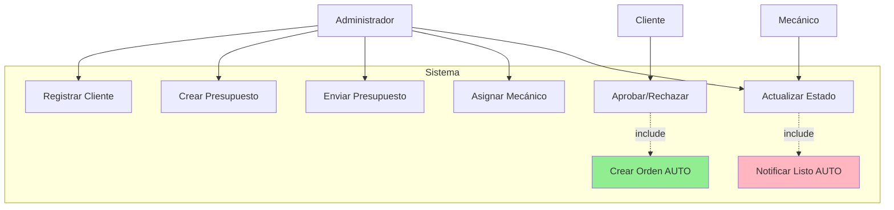
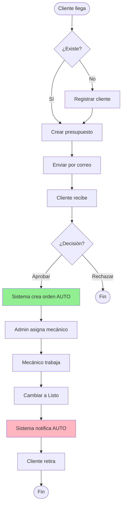
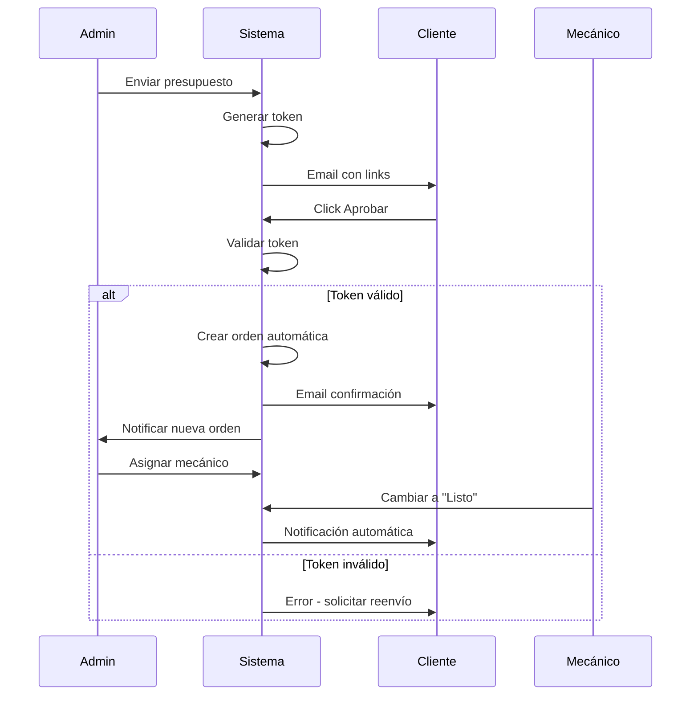
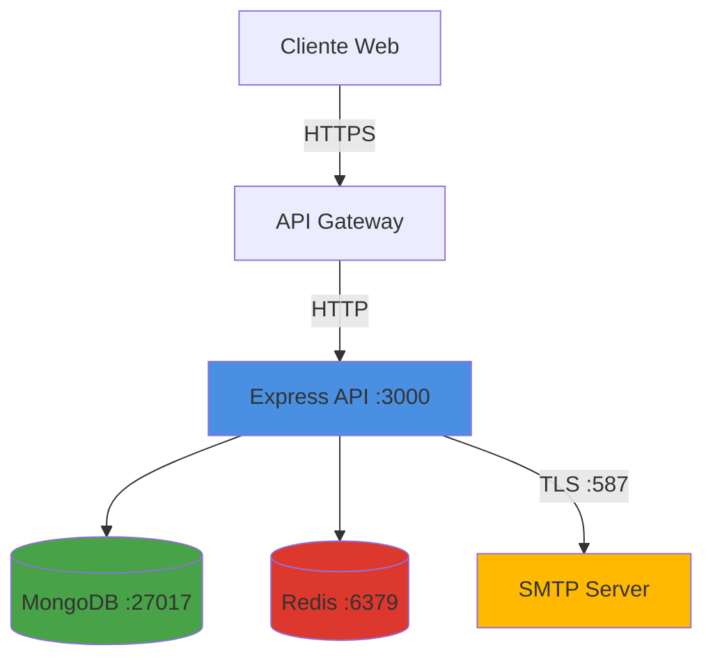
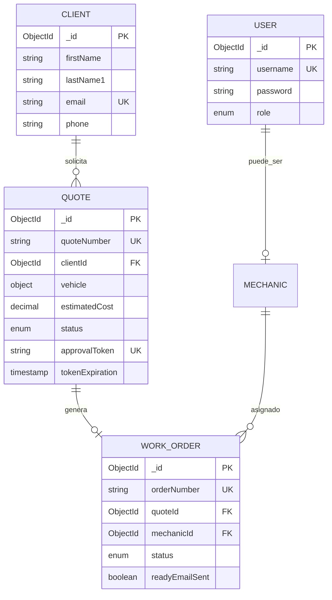

# DISEÑO FUNCIONAL Y TÉCNICO

**Versión:** 1.0  
**Fecha:** 31 Octubre 2025  
**Equipo:** Marcos Godoy, Alvaro Sandoval, Vicente Ortiz, Martin Valdebenito

---

## ÍNDICE
1. [Diseño Funcional](#1-diseño-funcional)
2. [Diseño Técnico](#2-diseño-técnico)
3. [Configuración](#3-configuración)
4. [Checklist](#4-checklist)

---

# 1. DISEÑO FUNCIONAL

## 1.1. Casos de Uso

**Trazabilidad:** REQ-002, REQ-003, REQ-004, REQ-005



**Actores:**
- **Administrador:** Gestión completa (clientes, presupuestos, órdenes, mecánicos)
- **Mecánico:** Ver órdenes asignadas, actualizar estado, agregar notas
- **Cliente:** Aprobar/rechazar presupuestos vía correo

---

## 1.2. Flujo Principal (BPMN)

**Proceso:** Cliente → Presupuesto → Aprobación → Orden → Entrega



---

## 1.3. Secuencia de Aprobación



---

# 2. DISEÑO TÉCNICO

## 2.1. Arquitectura (C4 - Contenedores)

**Stack:** Node.js 18 + Express + MongoDB 6.0 + Redis 7.0



**Comunicación:**
- Externo: HTTPS/TLS 1.3
- Interno: HTTP (red Docker aislada)
- Email: SMTP/TLS 587

---

## 2.2. Base de Datos (ER)



**Índices:** _id (PK), username, email, quoteNumber, orderNumber, status, createdAt

---

## 2.3. API REST - Endpoints

### Autenticación
- `POST /api/auth/login` - Login (público)
- `POST /api/auth/register` - Crear usuario (Admin)
- `GET /api/auth/me` - Usuario actual

### Clientes
- `GET /api/clients` - Listar (paginado, búsqueda)
- `POST /api/clients` - Crear
- `PUT /api/clients/:id` - Editar
- `DELETE /api/clients/:id` - Eliminar (validar sin dependencias)

### Presupuestos
- `GET /api/quotes` - Listar (filtros: status, clientId)
- `POST /api/quotes` - Crear
- `PUT /api/quotes/:id` - Editar (solo si pending)
- `POST /api/quotes/:id/send-email` - Enviar por correo
- `GET /api/quotes/:id/approve?token=xxx` - Aprobar (cliente)
- `GET /api/quotes/:id/reject?token=xxx` - Rechazar (cliente)

### Órdenes
- `GET /api/orders` - Listar (filtros: status, mechanicId)
- `PUT /api/orders/:id/status` - Cambiar estado
- `PUT /api/orders/:id/assign` - Asignar mecánico
- `PUT /api/orders/:id` - Agregar notas/costo

### Mecánicos
- `GET /api/mechanics` - Listar
- `POST /api/mechanics` - Crear
- `GET /api/mechanics/:id/orders` - Órdenes asignadas

**Autenticación:** JWT Bearer Token (24h)  
**Rate Limit:** 100 req/15min

---

## 2.4. Caché Redis

| Pattern | TTL | Invalidación |
|---------|-----|--------------|
| `cache:clients:list:{page}` | 5min | POST/PUT/DELETE clients |
| `cache:client:{id}` | 10min | PUT/DELETE client |
| `cache:quotes:list:{status}` | 3min | POST/PUT quotes |
| `cache:order:{id}` | 5min | PUT/DELETE order |

**Hit Rate esperado:** >70%

---

## 2.5. Notificaciones Automáticas

### Envío de Presupuesto
```javascript
// Admin solicita envío
POST /api/quotes/:id/send-email

// Sistema:
1. Generar token UUID v4 (válido 7 días)
2. Enviar correo con links:
   - Aprobar: /api/quotes/:id/approve?token=xxx
   - Rechazar: /api/quotes/:id/reject?token=xxx
3. Marcar emailSent = true
```

### Vehículo Listo
```javascript
// Hook automático en WorkOrder
pre('save', async function() {
  if (this.status === 'ready' && !this.readyEmailSent) {
    await emailService.sendReadyNotification(this);
    this.readyEmailSent = true;
  }
});
```

**Reintentos:** 3 intentos con backoff (5s, 10s, 20s)

---

# 3. CONFIGURACIÓN

## 3.1. Docker Compose

```yaml
version: '3.8'

services:
  api:
    build: .
    ports:
      - "3000:3000"
    environment:
      - MONGODB_URI=mongodb://mongo:27017/taller
      - REDIS_URL=redis://redis:6379
      - JWT_SECRET=${JWT_SECRET}
      - SMTP_HOST=${SMTP_HOST}
    depends_on:
      - mongo
      - redis
    restart: unless-stopped

  mongo:
    image: mongo:6.0
    ports:
      - "27017:27017"
    volumes:
      - mongo_data:/data/db

  redis:
    image: redis:7.0-alpine
    ports:
      - "6379:6379"
    volumes:
      - redis_data:/data

volumes:
  mongo_data:
  redis_data:
```

## 3.2. Variables (.env)

```bash
# Server
NODE_ENV=production
PORT=3000

# Database
MONGODB_URI=mongodb://mongo:27017/taller
REDIS_URL=redis://redis:6379

# Auth
JWT_SECRET=change-in-production-min-32-chars
JWT_EXPIRES_IN=24h

# Email
SMTP_HOST=smtp.gmail.com
SMTP_PORT=587
SMTP_USER=your-email@gmail.com
SMTP_PASS=app-password
```

## 3.3. Estructura

```
src/
├── config/          # DB, Redis, Email config
├── models/          # Mongoose schemas
├── routes/          # Express routes
├── controllers/     # Request handlers
├── services/        # Business logic
├── middlewares/     # Auth, validation
└── utils/           # Helpers, templates
```

---

# 4. CHECKLIST

## Semana 1
- [ ] Setup repo + Docker
- [ ] Conexión MongoDB + Redis
- [ ] Autenticación JWT
- [ ] CRUD Clientes

## Semana 2
- [ ] CRUD Presupuestos
- [ ] Envío correos con tokens
- [ ] Aprobación/rechazo
- [ ] Creación automática órdenes

## Semana 3
- [ ] Gestión órdenes
- [ ] Asignación mecánicos
- [ ] Notificación automática "Listo"
- [ ] Permisos por rol

## Semana 4
- [ ] Caché Redis implementado
- [ ] Testing integración
- [ ] Documentación Postman
- [ ] Deploy final

---

**Estado:** Aprobado para desarrollo
