# DISEÑO FUNCIONAL Y TÉCNICO

**Versión:** 1.0  
**Fecha:** 31 Octubre 2025  
**Equipo:** Marcos Godoy, Alvaro Sandoval, Vicente Ortiz, Martin Valdebenito

---

## ÍNDICE
1. [Diseño Funcional](#1-diseño-funcional)
2. [Diseño Técnico](#2-diseño-técnico)
3. [Configuración y Despliegue](#3-configuración-y-despliegue)
4. [Checklist de Implementación](#4-checklist-de-implementación)

---

# 1. DISEÑO FUNCIONAL

## 1.1. Diagrama de Casos de Uso

**Trazabilidad:** REQ-002, REQ-003, REQ-004, REQ-005

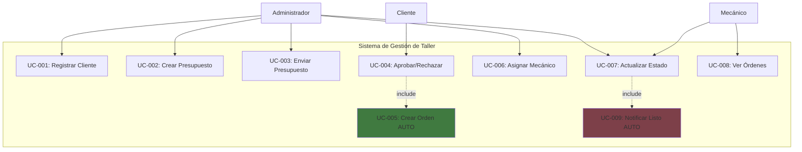

**Leyenda:**
- Verde: Proceso automático
- Rosa: Notificación automática

## 1.2 Diagrama UC Registrar Cliente

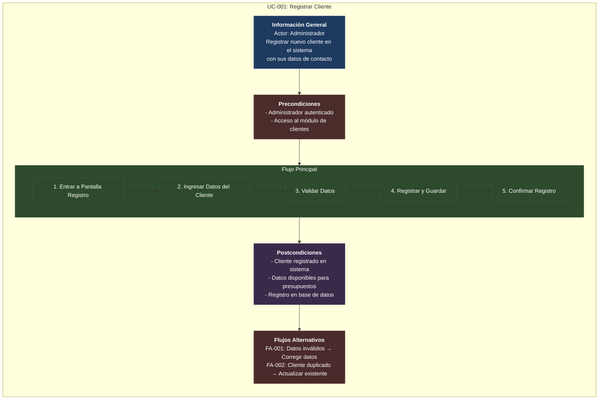

## 1.3 Diagrama UC crear presupuesto

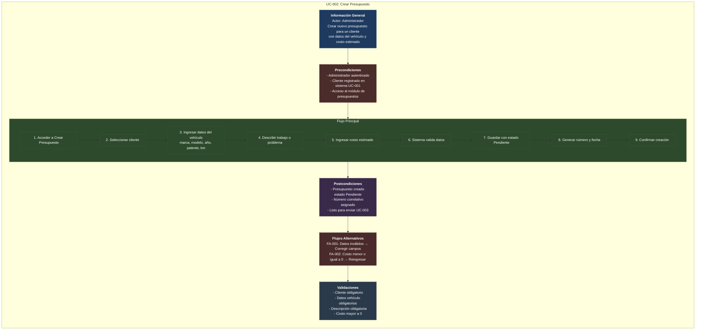

## 1.4 Diagrama UC enviar presupuesto

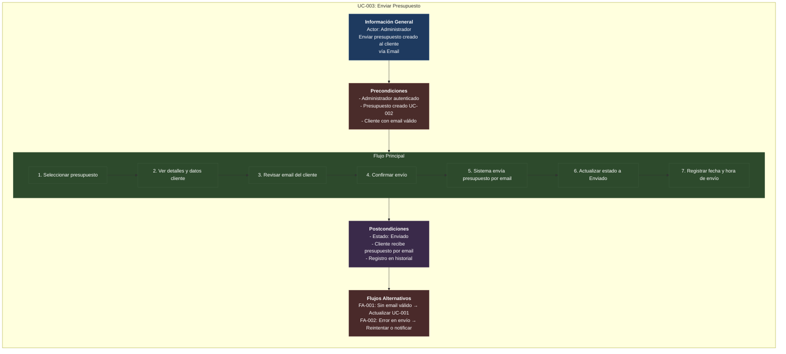

## 1.5 Diagrama UC Aprobar/Rechazar

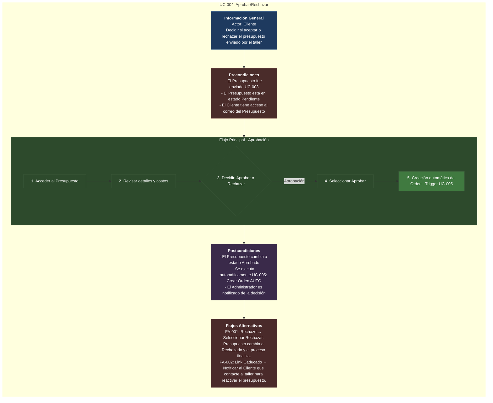

## 1.6 Diagrama UC Crear orden auto

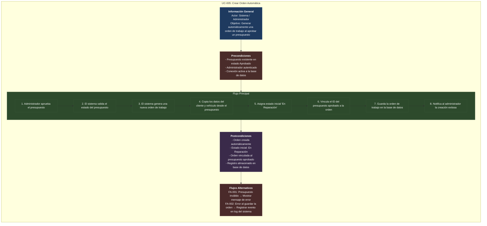

## 1.7 Diagrama UC Asignar mecanico

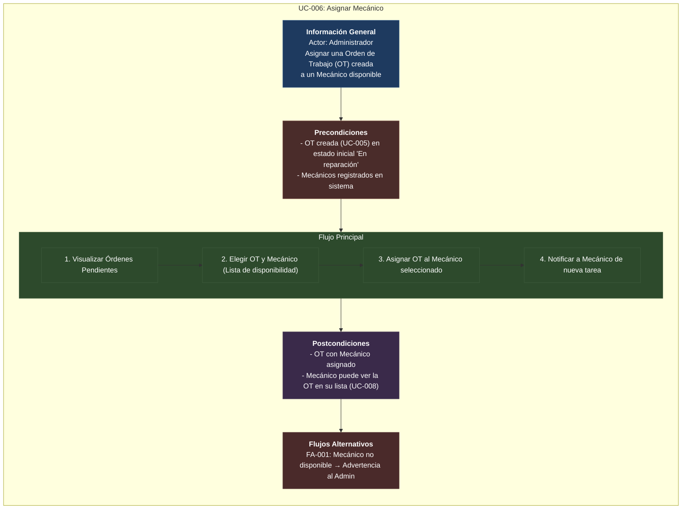

## 1.8 Diagrama UC Actualizar estado
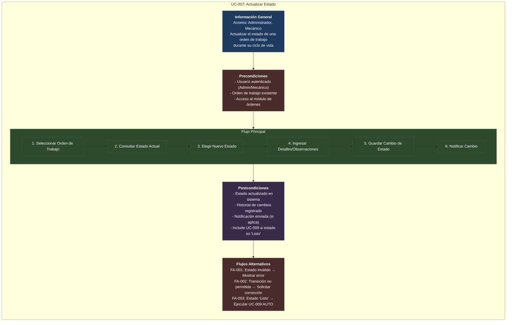

## 1.9 Diagrama UC Ver ordenes de trabajo

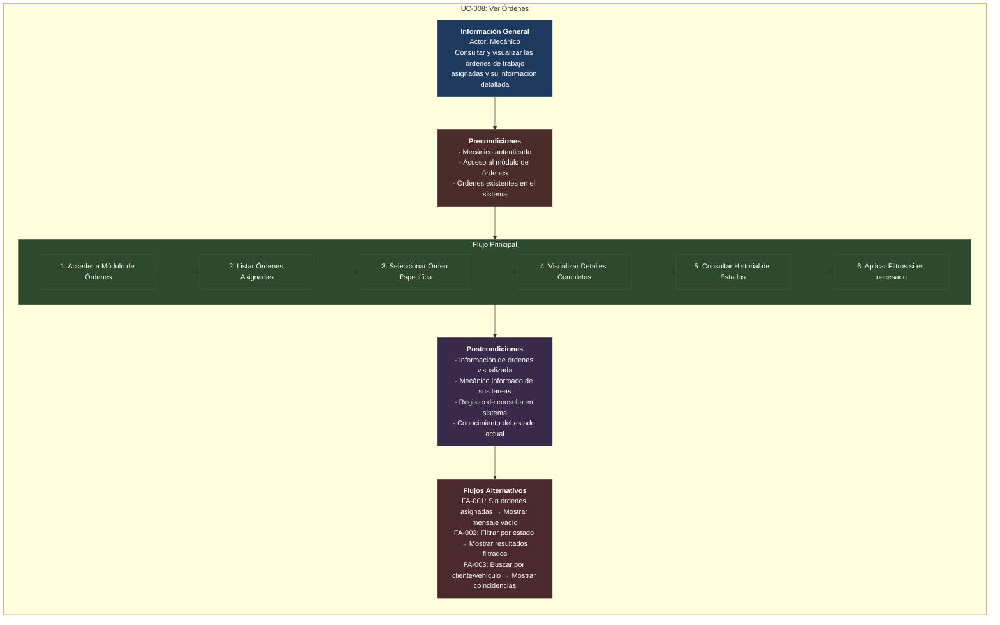


## 1.10 Diagrama UC Notificar listo auto
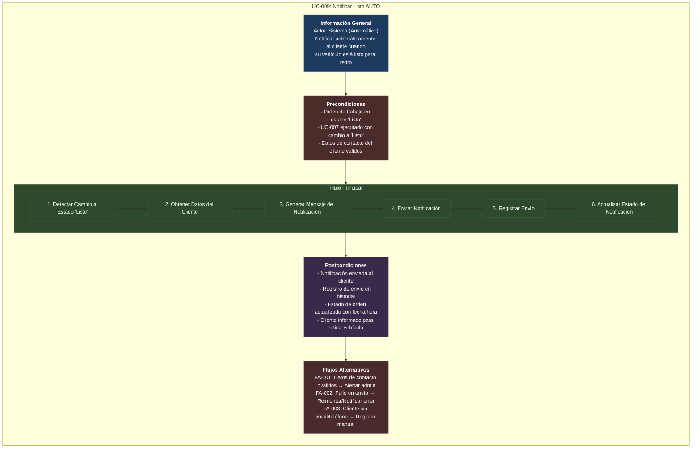

## 1.2. Flujo Principal de Procesos

**Proceso:** Desde llegada del cliente hasta entrega del vehículo

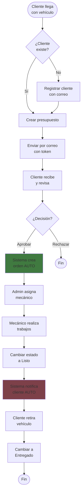

---

## 1.3. Mapa de Funcionalidades por Rol

### Administrador
| Módulo | Funcionalidades | Casos de Uso |
|--------|-----------------|--------------|
| Clientes | CRUD completo, búsqueda por nombre/email | UC-001 |
| Presupuestos | CRUD, envío por correo, aprobación manual | UC-002, UC-003, UC-004 |
| Órdenes | Visualización, asignación mecánicos, cambio estados | UC-006, UC-007 |
| Mecánicos | CRUD, activar/desactivar | - |
| Sistema | Acceso total sin restricciones | - |

### Mecánico
| Módulo | Funcionalidades | Casos de Uso |
|--------|-----------------|--------------|
| Órdenes | Ver solo asignadas, actualizar estado, agregar notas | UC-007, UC-008 |
| Sistema | Acceso limitado a sus órdenes | - |

### Cliente (sin autenticación)
| Módulo | Funcionalidades | Casos de Uso |
|--------|-----------------|--------------|
| Presupuestos | Aprobar/rechazar vía link con token de seguridad | UC-004 |
| Notificaciones | Recibir correos automáticos | UC-009 |

---

## 1.4. Wireframes

### Pantalla: Login

### Pantalla: Dashboard Administrador

### Pantalla: Mis Órdenes (Mecánico)

---

# 2. DISEÑO TÉCNICO

## 2.1. Diagrama de Arquitectura

**Stack:** Node.js + Express + MongoDB + Redis + Docker

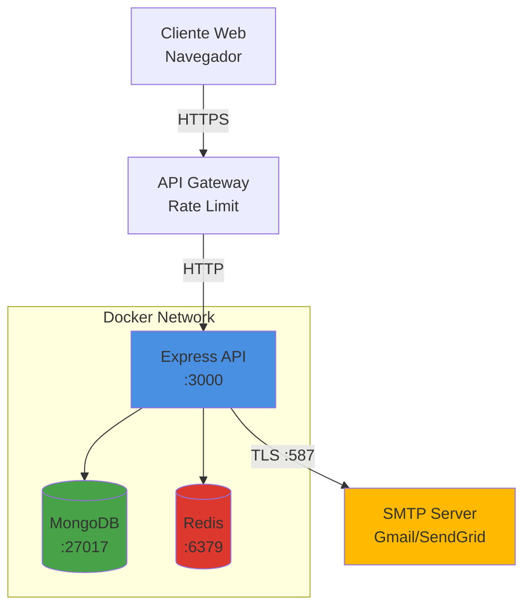

**Componentes:**
- **Express API:** Servidor REST con autenticación JWT
- **MongoDB:** Base de datos principal (usuarios, clientes, presupuestos, órdenes)
- **Redis:** Sistema de caché para optimizar consultas frecuentes
- **SMTP:** Servicio externo para envío de correos electrónicos

**Protocolos:**
- Cliente ↔ Gateway: HTTPS/TLS 1.3
- Gateway ↔ API: HTTP (red interna Docker)
- API ↔ MongoDB/Redis: TCP (red interna Docker)
- API ↔ SMTP: TLS/587

---

## 2.2. Modelo de Datos

### Diagrama Entidad-Relación

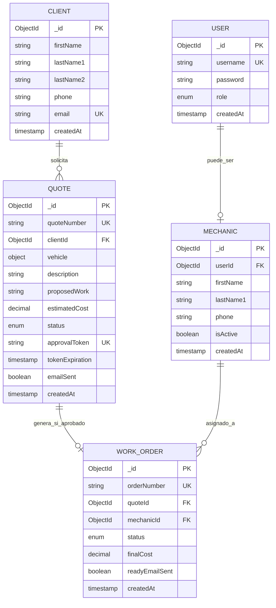

**Relaciones:**
- Un USER puede ser un MECHANIC (1:0..1)
- Un CLIENT tiene múltiples QUOTE (1:N)
- Un QUOTE genera una WORK_ORDER al aprobarse (1:0..1)
- Un MECHANIC tiene múltiples WORK_ORDER asignadas (1:N)

---

## 2.3. Esquemas Mongoose

### User Schema
```javascript
// models/User.js
const mongoose = require('mongoose');
const bcrypt = require('bcryptjs');

const userSchema = new mongoose.Schema({
  username: {
    type: String,
    required: [true, 'Username es obligatorio'],
    unique: true,
    trim: true,
    minlength: [3, 'Username debe tener al menos 3 caracteres']
  },
  password: {
    type: String,
    required: [true, 'Password es obligatorio'],
    minlength: [6, 'Password debe tener al menos 6 caracteres']
  },
  role: {
    type: String,
    enum: ['admin', 'mechanic'],
    default: 'mechanic'
  }
}, { 
  timestamps: true 
});

// Índices
userSchema.index({ username: 1 });

// Hash password antes de guardar
userSchema.pre('save', async function(next) {
  if (!this.isModified('password')) return next();
  this.password = await bcrypt.hash(this.password, 10);
  next();
});

// Método para verificar password
userSchema.methods.verifyPassword = async function(password) {
  return await bcrypt.compare(password, this.password);
};

// No retornar password en JSON
userSchema.set('toJSON', {
  transform: (doc, ret) => {
    delete ret.password;
    return ret;
  }
});

module.exports = mongoose.model('User', userSchema);
```

### Client Schema
```javascript
// models/Client.js
const mongoose = require('mongoose');

const clientSchema = new mongoose.Schema({
  firstName: {
    type: String,
    required: [true, 'Nombre es obligatorio'],
    trim: true
  },
  lastName1: {
    type: String,
    required: [true, 'Apellido paterno es obligatorio'],
    trim: true
  },
  lastName2: {
    type: String,
    trim: true
  },
  phone: {
    type: String,
    required: [true, 'Teléfono es obligatorio'],
    minlength: [9, 'Teléfono debe tener al menos 9 caracteres']
  },
  email: {
    type: String,
    required: [true, 'Email es obligatorio'],
    unique: true,
    lowercase: true,
    trim: true,
    match: [/^\S+@\S+\.\S+$/, 'Email no válido']
  }
}, { 
  timestamps: true 
});

// Índices
clientSchema.index({ email: 1 });
clientSchema.index({ firstName: 1, lastName1: 1 });

// Método para obtener nombre completo
clientSchema.methods.getFullName = function() {
  return `${this.firstName} ${this.lastName1} ${this.lastName2 || ''}`.trim();
};

// Validar si se puede eliminar
clientSchema.methods.canDelete = async function() {
  const Quote = mongoose.model('Quote');
  const hasQuotes = await Quote.exists({ clientId: this._id });
  return !hasQuotes;
};

module.exports = mongoose.model('Client', clientSchema);
```

### Quote Schema
```javascript
// models/Quote.js
const mongoose = require('mongoose');
const { v4: uuidv4 } = require('uuid');

const vehicleSchema = new mongoose.Schema({
  brand: { type: String, required: true },
  model: { type: String, required: true },
  year: { 
    type: Number, 
    required: true,
    min: [1900, 'Año debe ser mayor a 1900'],
    max: [new Date().getFullYear() + 1, 'Año no válido']
  },
  licensePlate: { type: String, required: true },
  mileage: { type: Number, min: 0 }
}, { _id: false });

const quoteSchema = new mongoose.Schema({
  quoteNumber: {
    type: String,
    unique: true
  },
  clientId: {
    type: mongoose.Schema.Types.ObjectId,
    ref: 'Client',
    required: true
  },
  vehicle: {
    type: vehicleSchema,
    required: true
  },
  description: {
    type: String,
    required: [true, 'Descripción es obligatoria']
  },
  proposedWork: {
    type: String,
    required: [true, 'Trabajo propuesto es obligatorio']
  },
  estimatedCost: {
    type: Number,
    required: [true, 'Costo estimado es obligatorio'],
    min: [0, 'Costo debe ser mayor o igual a 0']
  },
  status: {
    type: String,
    enum: ['pending', 'approved', 'rejected'],
    default: 'pending'
  },
  approvalToken: {
    type: String,
    unique: true,
    sparse: true
  },
  tokenExpiration: Date,
  tokenUsed: {
    type: Boolean,
    default: false
  },
  emailSent: {
    type: Boolean,
    default: false
  },
  emailSentAt: Date,
  workOrderId: {
    type: mongoose.Schema.Types.ObjectId,
    ref: 'WorkOrder'
  },
  notes: String
}, { 
  timestamps: true 
});

// Índices
quoteSchema.index({ quoteNumber: 1 });
quoteSchema.index({ clientId: 1 });
quoteSchema.index({ status: 1 });
quoteSchema.index({ approvalToken: 1 });

// Generar número de presupuesto automáticamente
quoteSchema.pre('save', async function(next) {
  if (!this.quoteNumber) {
    const count = await mongoose.model('Quote').countDocuments();
    this.quoteNumber = `PRES-${String(count + 1).padStart(4, '0')}`;
  }
  next();
});

// Método para generar token de aprobación
quoteSchema.methods.generateToken = function() {
  this.approvalToken = uuidv4();
  this.tokenExpiration = new Date(Date.now() + 7 * 24 * 60 * 60 * 1000); // 7 días
  return this.approvalToken;
};

// Validar si se puede editar
quoteSchema.methods.canEdit = function() {
  return this.status === 'pending';
};

module.exports = mongoose.model('Quote', quoteSchema);
```

### WorkOrder Schema
```javascript
// models/WorkOrder.js
const mongoose = require('mongoose');

const workOrderSchema = new mongoose.Schema({
  orderNumber: {
    type: String,
    unique: true
  },
  quoteId: {
    type: mongoose.Schema.Types.ObjectId,
    ref: 'Quote',
    required: true
  },
  mechanicId: {
    type: mongoose.Schema.Types.ObjectId,
    ref: 'Mechanic',
    required: true
  },
  status: {
    type: String,
    enum: ['in_progress', 'ready', 'delivered'],
    default: 'in_progress'
  },
  estimatedDelivery: Date,
  actualDelivery: Date,
  additionalNotes: String,
  finalCost: {
    type: Number,
    min: 0
  },
  readyEmailSent: {
    type: Boolean,
    default: false
  },
  readyEmailSentAt: Date
}, { 
  timestamps: true 
});

// Índices
workOrderSchema.index({ orderNumber: 1 });
workOrderSchema.index({ quoteId: 1 });
workOrderSchema.index({ mechanicId: 1 });
workOrderSchema.index({ status: 1 });

// Generar número de orden automáticamente
workOrderSchema.pre('save', async function(next) {
  if (!this.orderNumber) {
    const count = await mongoose.model('WorkOrder').countDocuments();
    this.orderNumber = `ORD-${String(count + 1).padStart(4, '0')}`;
  }
  
  // Notificación automática al cambiar a "ready"
  if (this.isModified('status') && this.status === 'ready' && !this.readyEmailSent) {
    const emailService = require('../services/emailService');
    await emailService.sendReadyNotification(this);
    this.readyEmailSent = true;
    this.readyEmailSentAt = new Date();
  }
  
  next();
});

module.exports = mongoose.model('WorkOrder', workOrderSchema);
```

---

## 2.4. Estrategia de Caché con Redis

### Configuración de Keys

| Pattern | TTL | Ejemplo | Invalidación |
|---------|-----|---------|--------------|
| `cache:clients:list:{page}` | 5min | `cache:clients:list:1` | POST/PUT/DELETE clients |
| `cache:client:{id}` | 10min | `cache:client:507f1f77` | PUT/DELETE client específico |
| `cache:quotes:list:{status}` | 3min | `cache:quotes:list:pending` | POST/PUT quotes |
| `cache:quote:{id}` | 10min | `cache:quote:507f1f77` | PUT/DELETE quote específico |
| `cache:orders:mechanic:{id}` | 2min | `cache:orders:mechanic:507f` | PUT orders de ese mecánico |
| `cache:order:{id}` | 5min | `cache:order:507f1f77` | PUT/DELETE order específico |

### Implementación

```javascript
// services/cacheService.js
class CacheService {
  constructor(redisClient) {
    this.redis = redisClient;
  }

  async getOrFetch(key, fetchFn, ttl = 300) {
    try {
      const cached = await this.redis.get(key);
      if (cached) {
        return JSON.parse(cached);
      }

      const data = await fetchFn();
      await this.redis.setex(key, ttl, JSON.stringify(data));
      return data;
    } catch (error) {
      console.error(`Cache error: ${error.message}`);
      return await fetchFn(); // Fallback sin caché
    }
  }

  async invalidate(pattern) {
    try {
      const keys = await this.redis.keys(pattern);
      if (keys.length > 0) {
        await this.redis.del(...keys);
      }
    } catch (error) {
      console.error(`Cache invalidation error: ${error.message}`);
    }
  }
}
```

### Uso en Servicios

```javascript
// Ejemplo: orderService.js
async getOrderById(orderId) {
  return await cacheService.getOrFetch(
    `cache:order:${orderId}`,
    async () => {
      return await WorkOrder.findById(orderId)
        .populate('quoteId')
        .populate('mechanicId')
        .lean();
    },
    300 // 5 minutos
  );
}

async updateOrderStatus(orderId, newStatus) {
  const order = await WorkOrder.findById(orderId);
  order.status = newStatus;
  await order.save();
  
  // Invalidar caché relacionado
  await cacheService.invalidate(`cache:order:${orderId}`);
  await cacheService.invalidate(`cache:orders:*`);
  
  return order;
}
```

**Métricas esperadas:**
- Hit Rate: >70% en listados frecuentes
- Reducción carga DB: ~50%
- Tiempo respuesta con caché: <100ms

---

## 2.5. API REST - Endpoints Principales

### Autenticación

| Método | Endpoint | Descripción | Auth | Input | Output |
|--------|----------|-------------|------|-------|--------|
| POST | `/api/auth/login` | Iniciar sesión | No | `{username, password}` | `{token, user}` |
| POST | `/api/auth/register` | Registrar usuario | Admin | `{username, password, role}` | `{user}` |
| GET | `/api/auth/me` | Usuario actual | Sí | - | `{user}` |
| GET | `/api/users/:id` | Ver usuario específico | Admin | - | `{user}` |

### Clientes

| Método | Endpoint | Descripción | Auth | Input | Output |
|--------|----------|-------------|------|-------|--------|
| GET | `/api/clients` | Listar clientes | Admin | Query: `?page=1&search=texto` | `{clients: [], pagination}` |
| GET | `/api/clients/:id` | Ver cliente | Admin | - | `{client}` |
| POST | `/api/clients` | Crear cliente | Admin | `{firstName, lastName1, email, phone}` | `{client}` |
| PUT | `/api/clients/:id` | Editar cliente | Admin | `{firstName?, email?, phone?}` | `{client}` |
| DELETE | `/api/clients/:id` | Eliminar cliente | Admin | - | `{message}` |

### Presupuestos

| Método | Endpoint | Descripción | Auth | Input | Output |
|--------|----------|-------------|------|-------|--------|
| GET | `/api/quotes` | Listar presupuestos | Admin | Query: `?status=pending` | `{quotes: [], pagination}` |
| GET | `/api/quotes/:id` | Ver presupuesto | Admin | - | `{quote, client}` |
| POST | `/api/quotes` | Crear presupuesto | Admin | `{clientId, vehicle, description, proposedWork, estimatedCost}` | `{quote}` |
| PUT | `/api/quotes/:id` | Editar presupuesto | Admin | `{description?, estimatedCost?}` | `{quote}` |
| POST | `/api/quotes/:id/send-email` | Enviar por correo | Admin | - | `{message, token}` |
| GET | `/api/quotes/:id/approve?token=xxx` | Aprobar (cliente) | No | Query param | HTML confirmación |
| GET | `/api/quotes/:id/reject?token=xxx` | Rechazar (cliente) | No | Query param | HTML confirmación |

### Órdenes de Trabajo

| Método | Endpoint | Descripción | Auth | Input | Output |
|--------|----------|-------------|------|-------|--------|
| GET | `/api/orders` | Listar órdenes | Admin/Mech | Query: `?status=in_progress&mechanicId=xxx` | `{orders: [], pagination}` |
| GET | `/api/orders/:id` | Ver orden | Admin/Mech | - | `{order, quote, client}` |
| PUT | `/api/orders/:id` | Editar orden | Admin | `{additionalNotes?, finalCost?}` | `{order}` |
| PUT | `/api/orders/:id/status` | Cambiar estado | Admin/Mech | `{status}` | `{order, emailSent?}` |
| PUT | `/api/orders/:id/assign` | Asignar mecánico | Admin | `{mechanicId}` | `{order}` |

### Mecánicos

| Método | Endpoint | Descripción | Auth | Input | Output |
|--------|----------|-------------|------|-------|--------|
| GET | `/api/mechanics` | Listar mecánicos | Admin | Query: `?isActive=true` | `{mechanics: []}` |
| POST | `/api/mechanics` | Crear mecánico | Admin | `{userId, firstName, lastName1, phone}` | `{mechanic}` |
| GET | `/api/mechanics/:id/orders` | Órdenes asignadas | Admin/Mech | - | `{orders: []}` |

**Códigos HTTP:**
- `200` OK: Operación exitosa
- `201` Created: Recurso creado
- `400` Bad Request: Datos inválidos
- `401` Unauthorized: No autenticado
- `403` Forbidden: Sin permisos
- `404` Not Found: Recurso no existe
- `422` Unprocessable: Validación fallida

---

# 3. CONFIGURACIÓN Y DESPLIEGUE

## 3.1. Docker Compose

```yaml
version: '3.8'

services:
  api:
    build: .
    container_name: taller_api
    ports:
      - "3000:3000"
    environment:
      - NODE_ENV=production
      - MONGODB_URI=mongodb://mongo:27017/taller
      - REDIS_URL=redis://redis:6379
      - JWT_SECRET=${JWT_SECRET}
      - SMTP_HOST=${SMTP_HOST}
      - SMTP_PORT=${SMTP_PORT}
      - SMTP_USER=${SMTP_USER}
      - SMTP_PASS=${SMTP_PASS}
    depends_on:
      - mongo
      - redis
    restart: unless-stopped

  mongo:
    image: mongo:6.0
    container_name: taller_mongo
    ports:
      - "27017:27017"
    volumes:
      - mongo_data:/data/db
    restart: unless-stopped

  redis:
    image: redis:7.0-alpine
    container_name: taller_redis
    ports:
      - "6379:6379"
    volumes:
      - redis_data:/data
    restart: unless-stopped

volumes:
  mongo_data:
  redis_data:
```

## 3.2. Variables de Entorno

```bash
# Server
NODE_ENV=production
PORT=3000

# Database
MONGODB_URI=mongodb://mongo:27017/taller
REDIS_URL=redis://redis:6379

# Auth
JWT_SECRET=your-secret-min-32-chars
JWT_EXPIRES_IN=24h

# Email
SMTP_HOST=smtp.gmail.com
SMTP_PORT=587
SMTP_USER=your-email@gmail.com
SMTP_PASS=your-app-password
```

## 3.3. Estructura del Proyecto

```
taller-api/
├── src/
│   ├── config/              # Configuraciones (DB, Redis, Email)
│   ├── models/              # Esquemas Mongoose
│   ├── routes/              # Rutas Express
│   ├── controllers/         # Controladores
│   ├── services/            # Lógica de negocio
│   ├── middlewares/         # Auth, validación, errores
│   ├── utils/               # Utilidades
│   ├── app.js              # Configuración Express
│   └── server.js           # Punto de entrada
├── docs/                    # Documentación y diagramas
├── tests/                   # Tests unitarios e integración
├── .env.example
├── Dockerfile
├── docker-compose.yml
├── package.json
└── README.md
```

---

# 4. CHECKLIST DE IMPLEMENTACIÓN

## Semana 1: Infraestructura y Autenticación
- [ ] Configurar repositorio Git con Gitflow
- [ ] Setup Docker (Compose, Dockerfile)
- [ ] Conexión MongoDB + índices
- [ ] Conexión Redis + CacheService
- [ ] Modelo User + endpoints auth
- [ ] Middleware JWT
- [ ] Testing auth

## Semana 2: Clientes y Presupuestos
- [ ] Modelo Client + CRUD completo
- [ ] Modelo Quote + validaciones
- [ ] EmailService con reintentos
- [ ] Envío presupuestos con token
- [ ] Endpoints aprobar/rechazar
- [ ] Cache en listados
- [ ] Testing CRUD

## Semana 3: Órdenes y Mecánicos
- [ ] Modelo WorkOrder + hook automático
- [ ] Creación automática al aprobar presupuesto
- [ ] Modelo Mechanic + CRUD
- [ ] Endpoints órdenes (cambio estado, asignación)
- [ ] Notificación automática "Listo"
- [ ] Permisos por rol (admin/mechanic)
- [ ] Testing flujo completo

## Semana 4: Refinamiento y Entrega
- [ ] Validaciones completas en todos los endpoints
- [ ] Rate limiting en endpoints públicos
- [ ] Manejo de errores consistente
- [ ] Testing de integración
- [ ] Documentación Postman
- [ ] README con instrucciones de setup
- [ ] Deploy con docker-compose
- [ ] Revisión de código entre equipo

---

# ANEXOS

## A. Reglas de Negocio Críticas

1. **Presupuestos:**
   - Solo se pueden editar si `status = pending`
   - Token de aprobación válido por 7 días
   - Al aprobar, se crea orden automáticamente
   - No eliminar si tiene orden asociada

2. **Órdenes:**
   - Estados válidos: `in_progress → ready → delivered`
   - Al cambiar a `ready`, enviar correo automático al cliente
   - Mecánico solo ve y modifica sus órdenes asignadas
   - No eliminar si `status = ready` o `delivered`

3. **Clientes:**
   - Email debe ser único en el sistema
   - No eliminar si tiene presupuestos u órdenes asociadas

4. **Correos:**
   - Sistema de reintentos: 3 intentos con backoff (5s, 10s, 20s)
   - Flag para prevenir envíos duplicados
   - Timeout de 10s por intento

## B. Seguridad

- **Autenticación:** JWT con expiración de 24h
- **Passwords:** Hashing con bcrypt (10 rounds)
- **Rate Limiting:** 100 requests por 15 minutos en endpoints públicos
- **Validación:** express-validator en todos los inputs
- **Headers:** helmet para seguridad HTTP
- **CORS:** Configurado solo para orígenes permitidos

## C. Métricas de Rendimiento Objetivo

| Métrica | Objetivo |
|---------|----------|
| Tiempo respuesta API (sin caché) | < 2s |
| Tiempo respuesta API (con caché) | < 100ms |
| Hit rate de caché | > 70% |
| Uptime | > 99% |
| Tiempo envío email | < 10s |

---
**Próxima revisión:** Fin de Semana 2
---
